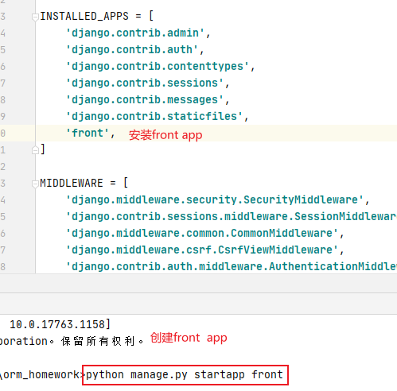
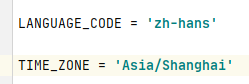
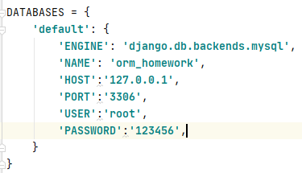

# ORM作业

### 准备工作



更改语言和时间区域

配置数据库

### 使用之前学到过的操作实现下面的查询操作

> 1、查询平均成绩大于60分的id和平均成绩
```python
def index1(request):
    #1、查询平均成绩大于60分的id和平均成绩
    students = Student.objects.annotate(score_avg=Avg('score__number')).filter(score_avg__gt=60).values('id','score_avg')
    for student in students:
        print(student)
    '''
    {'id': 1, 'score_avg': 83.33333333333333}
    {'id': 3, 'score_avg': 91.0}
    {'id': 4, 'score_avg': 64.75}
    '''
    print(connection.queries[2:])
    #'SELECT `student`.`id`, AVG(`score`.`number`) AS `score_avg` FROM `student` LEFT OUTER JOIN `score` ON (`student`.`id` = `score`.`student_id`) GROUP BY `student`.`id` HAVING AVG(`score`.`number`) > 60.0e0 ORDER BY NULL'
    return HttpResponse('index1')
```
> 2、查询所有同学的id、姓名、选课的数量、总成绩
```python
def index2(request):
    #2、查询所有同学的id、姓名、选课的数量、总成绩
    students = Student.objects.annotate(course_nums=Count('score__id'),total=Sum('score__number')).values('id','name','course_nums','total')
    for student in students:
        print(student)
    '''
    {'id': 1, 'name': '张三', 'course_nums': 3, 'total': 250.0}
    {'id': 2, 'name': '李四', 'course_nums': 4, 'total': 178.0}
    {'id': 3, 'name': '王五', 'course_nums': 4, 'total': 364.0}
    {'id': 4, 'name': '赵六', 'course_nums': 4, 'total': 259.0}
    '''
    print(connection.queries[2:])
    '''
    'SELECT `student`.`id`, `student`.`name`, COUNT(`score`.`id`) AS `course_nums`, SUM(`score`.`number`) AS `total` FROM `student` LEFT OUTER JOIN `score` ON (`student`.`id` = `score`.`student_id`) GROUP BY `student`.`id` ORDER BY NULL'
    '''
    return HttpResponse('index2')
```
> 3、查询姓“李”的老师的个数
```python
def index3(request):
    count = Teacher.objects.filter(name__startswith='李').count()
    print(count)# 1 姓李的老师只有一个
    return HttpResponse('index3')
```
> 4、查询没学过“李老师”课的同学的id、姓名
```python
def index4(request):
    students = Student.objects.exclude(score__course__teacher__name='李老师').values('id','name')
    for student in students:
        print(student)
        #{'id': 1, 'name': '张三'}
    print(connection.queries)
    #"SELECT `student`.`id`, `student`.`name` FROM `student` WHERE NOT (`student`.`id` IN (SELECT U1.`student_id` FROM `score` U1 INNER JOIN `course` U2 ON (U1.`course_id` = U2.`id`) INNER JOIN `teacher` U3 ON (U2.`teacher_id` = U3.`id`) WHERE U3.`name` = '李老师'))"
    return HttpResponse('index4')
```
> 5、查询学过课程id为2的所有同学的id和姓名
```python
def index5(request):
    #查询学过课程id为1和2的所有同学的id和姓名
    students = Student.objects.filter(score__course__in=[1,2]).values('id','name')
    for student in students:
        print(student)
        '''
        {'id': 1, 'name': '张三'}
        {'id': 1, 'name': '张三'}
        {'id': 2, 'name': '李四'}
        {'id': 2, 'name': '李四'}
        {'id': 3, 'name': '王五'}
        {'id': 3, 'name': '王五'}
        {'id': 4, 'name': '赵六'}
        {'id': 4, 'name': '赵六'}
        '''
    students = Student.objects.filter(score__course__in=[1, 2]).values('id', 'name').distinct()
    for student in students:
        print(student)
        '''
        {'id': 1, 'name': '张三'}
        {'id': 2, 'name': '李四'}
        {'id': 3, 'name': '王五'}
        {'id': 4, 'name': '赵六'}
        '''
    print(connection.queries[2:])
    return HttpResponse('index5')
```
> 6、查询学过‘黄老师’所教的‘所有课’的同学的id和姓名
```python
def index6(request):
    #查询学过‘黄老师’所教的‘所有课’的同学的id和姓名
    #1、先找到每一位学生学习黄老师课程的数量 A
    #2、在课程表中找到黄老师教的课程的数量 B
    #3、判断A是否等于B，如果相等，那么意味着这位学生学完黄老师的所有课程  annotate相当于生成一个新的字段
    students = Student.objects.annotate(nums = Count("score__course",filter=Q(score__course__teacher__name='李老师'))).filter(nums =Course.objects.filter(teacher__name='李老师').count()).values('id','name')
    for student in students:
        print(student)
        '''
        {'id': 1, 'name': '张三'}
        {'id': 2, 'name': '李四'}
        {'id': 3, 'name': '王五'}
        {'id': 4, 'name': '赵六'}
        '''
    print(connection.queries[2:])
    #[{'sql': "SELECT COUNT(*) AS `__count` FROM `course` INNER JOIN `teacher` ON (`course`.`teacher_id` = `teacher`.`id`) WHERE `teacher`.`name` = '黄老师'", 'time': '0.000'}, {'sql': "SELECT `student`.`id`, `student`.`name` FROM `student` LEFT OUTER JOIN `score` ON (`student`.`id` = `score`.`student_id`) LEFT OUTER JOIN `course` ON (`score`.`course_id` = `course`.`id`) LEFT OUTER JOIN `teacher` ON (`course`.`teacher_id` = `teacher`.`id`) GROUP BY `student`.`id` HAVING COUNT(CASE WHEN (`teacher`.`name` = '黄老师') THEN `score`.`course_id` ELSE NULL END) = 2 ORDER BY NULL", 'time': '0.000'}]
    return HttpResponse('index6')
```
> 7、查询所有课程成绩小于60分的同学的id和姓名
```python
def index7(request):
    #查询所有课程成绩小于60分的同学的id和姓名
    students = Student.objects.exclude(score__number__gte=60).values('id','name')
    for student in students:
        print(student)
    #{'id': 2, 'name': '李四'}
    print(connection.queries)
    #'SELECT `student`.`id`, `student`.`name` FROM `student` WHERE NOT (`student`.`id` IN (SELECT U1.`student_id` FROM `score` U1 WHERE U1.`number` >= 60.0e0))
    return HttpResponse('index7')
```
> 8、查询没有学全所有课程的同学id、姓名
```python
def index8(request):
    #查询没有学全所有课程的同学id、姓名
    students = Student.objects.annotate(num = Count(F('score__course'))).filter(num__lt=Course.objects.count()).values('id','name')
    for student in students:
        print(student)
    #{'id': 1, 'name': '张三'}
    print(connection.queries)
    #{'sql': 'SELECT COUNT(*) AS `__count` FROM `course`', 'time': '0.000'}, {'sql': 'SELECT `student`.`id`, `student`.`name` FROM `student` LEFT OUTER JOIN `score` ON (`student`.`id` = `score`.`student_id`) GROUP BY `student`.`id` HAVING COUNT(`score`.`course_id`) < 4 ORDER BY NULL', 'time': '0.000'}
    return HttpResponse('index8')
```
> 9、查询所有学生的姓名、平均分，并且按照平均分从高到低排序
```python
def index9(request):
    #查询所有学生的姓名、平均分，并且按照平均分从高到低排序
    students = Student.objects.annotate(avg = Avg('score__number')).order_by('-avg').values('name','avg')
    for student in students:
        print(student)
    '''
    {'name': '王五', 'avg': 91.0}
    {'name': '张三', 'avg': 83.33333333333333}
    {'name': '赵六', 'avg': 64.75}
    {'name': '李四', 'avg': 42.0}
    '''
    print(connection.queries)
    #'SELECT `student`.`name`, AVG(`score`.`number`) AS `avg` FROM `student` LEFT OUTER JOIN `score` ON (`student`.`id` = `score`.`student_id`) GROUP BY `student`.`id` ORDER BY `avg` DESC'
    return HttpResponse('index9')
```
> 10、查询各科成绩的最高分和最低分，以如下形式显示：课程ID、课程名称、最高分、最低分
```python
def index10(request):
    #查询各科成绩的最高分和最低分，以如下形式显示：课程ID、课程名称、最高分、最低分
    courses = Course.objects.annotate(min =Min("score__number"),max=Max("score__number")).values('id','name','min','max')
    for course in courses:
        print(course)
    '''
    {'id': 1, 'name': 'Python', 'min': 40.0, 'max': 104.0}
    {'id': 2, 'name': '前端', 'min': 40.0, 'max': 90.0}
    {'id': 3, 'name': 'Java', 'min': 54.0, 'max': 94.0}
    {'id': 4, 'name': '安卓', 'min': 34.0, 'max': 90.0}
    '''
    print(connection.queries)
    #{'sql': 'SELECT `course`.`id`, `course`.`name`, MIN(`score`.`number`) AS `min`, MAX(`score`.`number`) AS `max` FROM `course` LEFT OUTER JOIN `score` ON (`course`.`id` = `score`.`course_id`) GROUP BY `course`.`id` ORDER BY NULL', 'time': '0.000'}
    return HttpResponse('index10')
```
> 11、查询每门课程的平均成绩，按照平均分成绩进行排序
```python
def index11(request):
    #查询每门课程的平均成绩，按照平均分成绩进行排序
    courses = Course.objects.annotate(avg = Avg('score__number')).order_by('avg').values('name','avg')
    for course in courses:
        print(course)
        '''
        {'name': '安卓', 'avg': 67.66666666666667}
        {'name': '前端', 'avg': 68.25}
        {'name': 'Python', 'avg': 70.0}
        {'name': 'Java', 'avg': 71.25}
        '''
    print(connection.queries)
    #{'sql': 'SELECT `course`.`name`, AVG(`score`.`number`) AS `avg` FROM `course` LEFT OUTER JOIN `score` ON (`course`.`id` = `score`.`course_id`) GROUP BY `course`.`id` ORDER BY `avg` ASC', 'time': '0.000'}
    return HttpResponse('index11')
```
> 12、统计总共有多少女生，多少男生
```python
def index12(request):
    #统计总共有多少女生，多少男生
    rows = Student.objects.aggregate(male_num=Count('gender',filter=Q(gender =1)),female_num=Count('gender',filter=Q(gender =2)))
    print(rows)
    #{'male_num': 2, 'female_num': 2}
    print(connection.queries)
    #{'sql': 'SELECT COUNT(CASE WHEN `student`.`gender` = 1 THEN `student`.`gender` ELSE NULL END) AS `male_num`, COUNT(CASE WHEN `student`.`gender` = 2 THEN `student`.`gender` ELSE NULL END) AS `female_num` FROM `student`', 'time': '0.000'}
    return HttpResponse('index12')
```
> 13、将‘黄老师’的每一门课程都在原来的基础之上加5分
```python
def index13(request):
    #将‘黄老师’的每一门课程都在原来的基础之上加5分
    rows = Score.objects.filter(course__teacher__name='黄老师').update(number = F("number")+5)
    print(rows)#8
    print(connection.queries)
    #{'sql': "SELECT `score`.`id` FROM `score` INNER JOIN `course` ON (`score`.`course_id` = `course`.`id`) INNER JOIN `teacher` ON (`course`.`teacher_id` = `teacher`.`id`) WHERE `teacher`.`name` = '黄老师'", 'time': '0.000'}, {'sql': 'UPDATE `score` SET `number` = (`score`.`number` + 5) WHERE `score`.`id` IN (1, 5, 9, 13, 3, 7, 11, 15)', 'time': '0.015'}
    return HttpResponse('index13')
```
> 14、查询两门以上不及格的同学的id、姓名、以及不及格课程数
```python
def index14(request):
    #查询两门以上不及格的同学的id、姓名、以及不及格课程数
    students = Student.objects.annotate(bad_count = Count('score__number',filter=Q(score__number__lt=60))).filter(bad_count__gte=2).values('id','name','bad_count')
    for student in students:
        print(student)
    #{'id': 2, 'name': '李四', 'bad_count': 3}
    print(connection.queries)
    #{'sql': 'SELECT `student`.`id`, `student`.`name`, COUNT(CASE WHEN `score`.`number` < 60.0e0 THEN `score`.`number` ELSE NULL END) AS `bad_count` FROM `student` LEFT OUTER JOIN `score` ON (`student`.`id` = `score`.`student_id`) GROUP BY `student`.`id` HAVING COUNT(CASE WHEN (`score`.`number` < 60.0e0) THEN `score`.`number` ELSE NULL END) >= 2 ORDER BY NULL', 'time': '0.000'}
    return HttpResponse('index14')
```
> 15、查询每门课的选课人数
 ```python
def index15(request):
    #查询每门课的选课人数
    courses = Course.objects.annotate(student_nums =Count('score__student')).values('id','name','student_nums')
    for course in courses:
        print(course)
    '''
    {'id': 1, 'name': 'Python', 'student_nums': 4}
    {'id': 2, 'name': '前端', 'student_nums': 4}
    {'id': 3, 'name': 'Java', 'student_nums': 4}
    {'id': 4, 'name': '安卓', 'student_nums': 3}
    '''
    print(connection.queries)
    #{'sql': 'SET SESSION TRANSACTION ISOLATION LEVEL READ COMMITTED', 'time': '0.000'}, {'sql': 'SELECT `course`.`id`, `course`.`name`, COUNT(`score`.`student_id`) AS `student_nums` FROM `course` LEFT OUTER JOIN `score` ON (`course`.`id` = `score`.`course_id`) GROUP BY `course`.`id` ORDER BY NULL', 'time': '0.000'}
    return HttpResponse('index15')
 ```