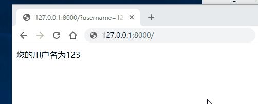

## 重定向

重定向分为永久性重定向和暂时性重定向，在页面上体现的操作就是浏览器会从一个页面自动跳转到另外一个页面。比如用户访问了一个需要权限的页面，但是该用户当前并没有登录，因此我们应该给他重定向到登录页面。

- 永久性重定向：http的状态码是301，多用于旧网址被废弃了要转到一个新的网址确保用户的访问，最经典的就是京东网站，你输入www.jingdong.com的时候，会被重定向到www.jd.com，因为jingdong.com这个网址已经被废弃了，被改成jd.com，所以这种情况下应该用永久重定向。
- 暂时性重定向：http的状态码是302，表示页面的暂时性跳转。比如访问一个需要权限的网址，如果当前用户没有登录，应该重定向到登录页面，这种情况下，应该用暂时性重定向。

在`Django`中，重定向是使用`redirect(to, *args, permanent=False, **kwargs)`来实现的。`to`是一个`url`，`permanent`代表的是这个重定向是否是一个永久的重定向，默认是`False`。关于重定向的使用。请看以下例子：

```python
:
    if request.GET.get("username"):
        return HttpResponse("%s，欢迎来到个人中心页面！")
    else:
        return redirect(reverse("user:login"))
#from django.shortcuts import render,redirect,reverse
from django.http import HttpResponse
# Create your views here.
def index(request):
    #如果没有登录，那么就重定向到注册页面
    #如果在URL中传递了username参数，那么久认为是登录了，否则就没有
    #/?username=xxx
    #request.GET 获取的是一个字典，get是方法
    username = request.GET.get("username")
    if username:
        return HttpResponse(f'您的用户名为：{username}')
    else:
        return redirect(reverse('signup'))
    #reverse('signup') 翻转到signup名字的url地址

def signup(request):
    return HttpResponse('注册页')
```



> 301与302状态码？

301是永久性的重定向，302是临时性的重定向。

