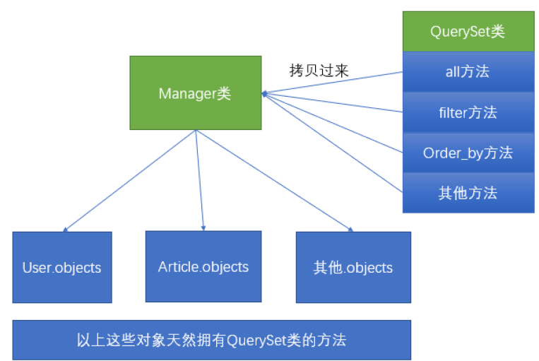

#### Query Set API

我们通常做查询操作的时候，都是通过`模型名字`.objects的方式进行操作。其实`模型名字`.objects是一个`django.db.models.manager.Manager`对象，而`manager`这个类是一个"空壳"的类，他本身没有任何的属性和方法的，他的方法全部都是通过python动态添加的方式，从`QuerySet`类中拷贝多来的。示例图如下：



以我们如果想要学习`ORM`模型的查找操作，必须首先要学会`QuerySet`上的一些`API`的使用。

#### 返回新的QuerySet的方法：

在使用`QuerySet`进行查找操作的时候，可以提供多种操作，比如过滤完后还要根据某个字段进行排序，那么这一系列的操作我们可以通过一个非常流畅的`链式调用`的方法进行。比如要从文章中获取标题为`123`，并且提取后要将结果根据发布的时间进行排序，那么可以使用以下方式来完成：

```python
articles = Article.objects.filter(title='123').order_by('create_time')

#可以先进行过滤
books = Book.objects.filter(id__gte=2)
books.filter(id !=3)
books.filter(~Q(id=3)) #id等于3然后反转

#可以进行两个filter
books = Book.objects.filter(id__gte=2).filter(~Q(id=3))

```

可以看到`order_by`方法是直接在`filter`执行后调用的。这说明`filter`返回的对象是一个拥有`order_by`方法的对象。而这个对象正是一个新的`QuerySet`对象。因此可以使用`order_by`方法。

那么以下将介绍在那些会返回新的`QuerySet`对象的方法。

`1、filter`：将满足条件的数据提取出来，返回一个新的`QuerySet`。具体的`filter`可以提供什么条件查询。请见查询操作章节。

`2、exclude`：排除满足条件的数据，返回一个新的`QuerySet`。示例代码如下：

```python
 Article.objects.exclude(title__contains='hello')
    
 #排除掉id为3的数据
books =Book.objects.filter(id__gte=2).exclude(id=3)
```

以上代码的意思是提取那些标题不包含`hello`的图书。

`3、annotate`：给`QuerySet`中的每个对象都添加一个使用查询表达式（聚合函数、F表达式、Q表达式、Func表达式等）的新字段。示例代码如下：

```python
articles = Article.objects.annotate(author_name=F("author__name"))
 #会调用出图书的作者名字，有外键数据表
books = Book.objects.annotate(author_name=F("author__name"))
```

以上代码将在每个对象中都添加一个`author__name`的字段，用来显示这个文章的作者的年龄。

`4、order_by`：指定将查询的结果根据某个字段进行排序。如果要倒叙排序，那么可以在这个字段的前面加一个负号。示例代码如下：

```python
 # 根据创建的时间正序排序
 articles = Article.objects.order_by("create_time")
 # 根据创建的时间倒序排序，在字段的前面加一个 - 号
 articles = Article.objects.order_by("-create_time")
 # 根据作者的名字进行排序
 articles = Article.objects.order_by("author__name")
 # 首先根据创建的时间进行排序，如果时间相同，则根据作者的名字进行排序
 articles = Article.objects.order_by("create_time",'author__name')

#================================================================
#根据create_time从小到大进行排序
    orders = BookOrder.objects.order_by('price')
    for order in orders:
        print('%s/%s'% (order.id,order.price))
    '''
    2/85.0
    3/88.0
    5/93.0
    4/94.0
    1/95.0
    '''
    print(connection.queries[-1])
#'SELECT `book_order`.`id`, `book_order`.`price`, `book_order`.`book_id` FROM `book_order` ORDER BY `book_order`.`price` ASC'

    orders = BookOrder.objects.order_by('-price')#从大到小排序
    for order in orders:
        print(order.price)
    '''
    95.0
    94.0
    93.0
    88.0
    85.0
    '''
    print(connection.queries[-1])
    #'SELECT `book_order`.`id`, `book_order`.`price`, `book_order`.`book_id` FROM `book_order` ORDER BY `book_order`.`price` DESC'

    #首先根据book_id从大到小排序，如果一样那么根据price从大到小进行排序
    orders = BookOrder.objects.order_by('-book_id','-price')
    for order in orders:
        print(order.book_id,',',order.price)
    '''
    2 , 94.0
    2 , 93.0
    1 , 95.0
    1 , 88.0
    1 , 85.0
    '''
    
      #提取图书数据，根据图书的销量进行排序（从大到小进行排序）
    books = Book.objects.annotate(order_nums=Count('bookorder__id')).order_by('-order_nums')
    for book in books:
        print(book.name,book.order_nums)
    '''
    三国演义 3
    水浒传 2
    西游记 0
    红楼梦 0
    '''
    print(connection.queries[-1])
    #'SELECT `book`.`id`, `book`.`name`, `book`.`pages`, `book`.`price`, `book`.`rating`, `book`.`author_id`, `book`.`publisher_id`, COUNT(`book_order`.`id`) AS `order_nums` FROM `book` LEFT OUTER JOIN `book_order` ON (`book`.`id` = `book_order`.`book_id`) GROUP BY `book`.`id` ORDER BY `order_nums` DESC'
    return HttpResponse('index3')
```

一定要注意的一点是，多个`order_by`，会把前面排序的规则给打乱，而使用后面的排序方式。比如以下代码：

```python
 articles = Article.objects.order_by("create_time").order_by("author__name")
```

他会根据作者的名字进行排序，而不是使用文章的创建时间。

`values`：用来指定在提取数据出来，需要提取哪些字段。默认情况下会把表中所有的字段全部都提取出来，可以使用`values`来进行指定，并且使用了`values`方法后，提取出的`QuerySet`中的数据类型不是模型，而是在`values`方法中指定的字段和值形成的字典：

```python
 articles = Article.objects.values("title",'content')
 for article in articles:
     print(article)
        
books = Book.objects.values('id','name').all()
#queryset里面存储的是 字典
   for book in books:
            print(book['id'],book['name'])
'''
1 三国演义
2 水浒传
3 西游记
4 红楼梦
'''
```

以上打印出来的`article`是类似于`{"title":"abc","content":"xxx"}`的形式。
如果在`values`中没有传递任何参数，那么将会返回这个恶模型中所有的属性。

`values`的返回值同样也是一个`QuerySet`对象，但是返回值是一个`字典`类型!

如果我们想要提取的是这个模型上关联的对象的属性，那么也是可以的，查找顺序跟`filter`的用法是一样的。示例代码如下：

```python

 books = Book.objects.values('id', 'name',author_name = F('author__name')).all()
    # queryset里面存储的是 字典
    #  F表达式经常用于动态的查找
    for book in books:
        print(book)
    '''
    {'id': 1, 'name': '三国演义', 'author__name': '罗贯中'}
    {'id': 2, 'name': '水浒传', 'author__name': '施耐庵'}
    {'id': 3, 'name': '西游记', 'author__name': '吴承恩'}
    {'id': 4, 'name': '红楼梦', 'author__name': '曹雪芹'}
    
    利用F表达式后：
    {'id': 1, 'name': '三国演义', 'author_name': '罗贯中'}
    {'id': 2, 'name': '水浒传', 'author_name': '施耐庵'}
    {'id': 3, 'name': '西游记', 'author_name': '吴承恩'}
    {'id': 4, 'name': '红楼梦', 'author_name': '曹雪芹'}
    '''
```

以上将会提取`author`的`name`字段，如果我们不想要这个名字，想要更改这个名字，那么可以使用关键字参数。F表达式取得名字不能与已有字段重复，否则会出错！示例代码如上！

在`values`中也是可以使用聚合函数的，代码如下：

```python
 #使用count聚合函数
    books = Book.objects.values('id','name',order_nums=Count('bookorder__id'))
    for book in books:
        print(book)
    '''
    {'id': 1, 'name': '三国演义', 'order_nums': 3}
    {'id': 2, 'name': '水浒传', 'order_nums': 2}
    {'id': 3, 'name': '西游记', 'order_nums': 0}
    {'id': 4, 'name': '红楼梦', 'order_nums': 0}
    '''
    print(connection.queries[-1])
#'SELECT `book`.`id`, `book`.`name`, COUNT(`book_order`.`id`) AS `order_nums` FROM `book` LEFT OUTER JOIN `book_order` ON (`book`.`id` = `book_order`.`book_id`) GROUP BY `book`.`id` ORDER BY NULL'
```


`values_list`：类似于`values`。只不过返回的`QuerySet`中，存储的不是字典，而是元组。示例代码如下：

```python
 articles = Article.objects.values_list("id","title")
 print(articles)

books = Book.objects.values_list()
print(type(books))
#<class 'django.db.models.query.QuerySet'>
for book in books:
    print(book)
'''返回的是元组数据
(1, '三国演义', 987, 98.0, 4.8, 3, 1)
(2, '水浒传', 967, 97.0, 4.83, 4, 1)
(3, '西游记', 1004, 95.0, 4.85, 2, 2)
(4, '红楼梦', 1007, 99.0, 4.9, 1, 2)
'''
print('=' * 50)
books = Book.objects.values_list('name',flat=True)
#只获取到name这个字段
print(type(books))
# <class 'django.db.models.query.QuerySet'>
for book in books:
    print(book)
'''返回的是元组数据,如果元组只有一个元素，那么后边就会有一个逗号
('三国演义',)
('水浒传',)
('西游记',)
('红楼梦',)
使用flat=True后的数据，如果有两个字段就会出现错误
三国演义
水浒传
西游记
红楼梦
'''
```

那么在打印`articles`后，结果为``等。
如果在`values_list`中只有一个字段。那么你可以传递`flat=True`来将结果扁平化。示例代码如下：

```python
 articles1 = Article.objects.values_list("title")
 >> <QuerySet [("abc",),("xxx",),...]>
 articles2 = Article.objects.values_list("title",flat=True)
 >> <QuerySet ["abc",'xxx',...]>
看上面的代码
一定要注意的是，flat只能用在只有一个字段的情况下，否则就会报错！
```

7、`all`：获取这个`ORM`模型的`QuerySet`对象。all在实际的应用中使用的比较少！

这个返回简单的返回一个`QuerySet`对象，这个`QuerySet`对象没有经过任何的修改（比如：过滤）等。

```python
def index5(request):
    books = Book.objects.all()
    for book in books:
        print(book)#Book object (1)输出的是一个对象
        print(book.id,book.name)#这里可以输出数据 4 红楼梦等
    return HttpResponse("index5")
```

8、`select_related`：在提取某个模型的数据的同时，也提前将相关联的数据提取出来。比如提取文章数据，可以使用`select_related`将`author`信息提取出来，以后再次使用`article.author`的时候就不需要再次去访问数据库了。可以减少数据库查询的次数。示例代码如下：

```python
 article = Article.objects.get(pk=1)
 >> article.author # 重新执行一次查询语句
 article = Article.objects.select_related("author").get(pk=2)
 >> article.author # 不需要重新执行查询语句了

def index6(requeset):
    #books = Book.objects.all()#应该是book关联的author字段中的名字，此时每次都需要查询语句有点浪费资源
    books = Book.objects.select_related("author","publisher")#在一次查询中讲author查询出来了,这个地方只能使用外键的字段
    for book in books:
        #print(book.name)
        print(book.author.name)
        print(book.publisher.name)
    '''
    罗贯中
    中国邮电出版社
    施耐庵
    中国邮电出版社
    吴承恩
    清华大学出版社
    曹雪芹
    清华大学出版社
    '''
    print(connection.queries[-1])
    #'SELECT `author`.`id`, `author`.`name`, `author`.`age`, `author`.`email` FROM `author` WHERE `author`.`id` = 1 LIMIT 21'
```

`selected_related`只能用在`一对多`或者`一对一`中，不能用在`多对多`或者`多对一`中。只能用在外键关联的对象身上。比如可以提前获取文章的作者，但是不能通过作者获取这个作者的文章，或者是通过某篇文章获取这个文章所有的标签。

9、`prefetch_related`：这个方法和`select_related`非常的类似，就是在访问多个表中的数据的时候，减少查询的次数。这个方法是为了解决`多对一`和`多对多`的关系的查询问题。比如要获取标题中带有`hello`字符串的文章以及他的所有标签，示例代码如下：

```python
 from django.db import connection
 articles = Article.objects.prefetch_related("tag_set").filter(title__contains='hello')
 print(articles.query) # 通过这条命令查看在底层的SQL语句
 for article in articles:
     print("title:",article.title)
     print(article.tag_set.all())

 # 通过以下代码可以看出以上代码执行的sql语句
 for sql in connection.queries:
     print(sql)
    
 def index7(request):
    # books = Book.objects.all()
    # for book in books:
    #     print('='*30)
    #     print(book.name)
    #     orders = book.bookorder_set.all()#sql语句查询的次数多了
    #     #对象.模型类小写_set.all 访问1对多模型
    #     for order in orders:
    #         print(order.id)
    #     '''
    #     三国演义
    #     1
    #     2
    #     3
    #     ==============================
    #     水浒传
    #     4
    #     5
    #     ==============================
    #     西游记
    #     ==============================
    #     红楼梦
    #     '''
    print('*'*80)
    # books = Book.objects.prefetch_related("bookorder_set")
    # #将所有的book查询出来，更具book ID将订单查询出来！做了两次查询
    # for book in books:
    #     print('='*30)
    #     print(book.name)
    #     orders = book.bookorder_set.all()#sql语句查询的次数多了
    #     #对象.模型类小写_set.all 访问1对多模型
    #     for order in orders:
    #         print(order.id)
    # #print(connection.queries)
    # #{'sql': 'SELECT `book`.`id`, `book`.`name`, `book`.`pages`, `book`.`price`, `book`.`rating`, `book`.`author_id`, `book`.`publisher_id` FROM `book`', 'time': '0.000'}, {'sql': 'SELECT `book_order`.`id`, `book_order`.`price`, `book_order`.`book_id` FROM `book_order` WHERE `book_order`.`book_id` IN (1, 2, 3, 4)', 'time': '0.000'}
    #
    # books = Book.objects.prefetch_related('author')
    # for book in books:
    #     print(book.author.name)
    #     '''
    #     罗贯中
    #     施耐庵
    #     吴承恩
    #     曹雪芹
    #     '''
    # print(connection.queries)
    #'SELECT `author`.`id`, `author`.`name`, `author`.`age`, `author`.`email` FROM `author` WHERE `author`.`id` IN (1, 2, 3, 4)'
#===========================================================
    #过滤价格大于90元的
    #传统做法
    # books =Book.objects.prefetch_related('bookorder_set')
    # #如果使用prefetch_related的时候，就不能使用类似filter产生新sql语句的方法
    # for book in books:
    #   print('='*50)
    #   print(book.name)
    #   orders = book.bookorder_set.filter(price__gte=90)#因使用filter，所以prefetch_related失效
    #   for order in orders:
    #     print(order.id)
    # print(connection.queries)
    '''
    三国演义
    1
    ==================================================
    水浒传
    4
    5
    ==================================================
    西游记
    ==================================================
    红楼梦
    [{'sql': 'SELECT @@SQL_AUTO_IS_NULL', 'time': '0.000'}, {'sql': 'SET SESSION TRANSACTION ISOLATION LEVEL READ COMMITTED', 'time': '0.000'}, {'sql': 'SELECT `book`.`id`, `book`.`name`, `book`.`pages`, `book`.`price`, `book`.`rating`, `book`.`author_id`, `book`.`publisher_id` FROM `book`', 'time': '0.000'}, {'sql': 'SELECT `book_order`.`id`, `book_order`.`price`, `book_order`.`book_id` FROM `book_order` WHERE `book_order`.`book_id` IN (1, 2, 3, 4)', 'time': '0.000'}, {'sql': 'SELECT `book_order`.`id`, `book_order`.`price`, `book_order`.`book_id` FROM `book_order` WHERE (`book_order`.`book_id` = 1 AND `book_order`.`price` >= 90.0e0)', 'time': '0.000'}, {'sql': 'SELECT `book_order`.`id`, `book_order`.`price`, `book_order`.`book_id` FROM `book_order` WHERE (`book_order`.`book_id` = 2 AND `book_order`.`price` >= 90.0e0)', 'time': '0.000'}, {'sql': 'SELECT `book_order`.`id`, `book_order`.`price`, `book_order`.`book_id` FROM `book_order` WHERE (`book_order`.`book_id` = 3 AND `book_order`.`price` >= 90.0e0)', 'time': '0.000'}, {'sql': 'SELECT `book_order`.`id`, `book_order`.`price`, `book_order`.`book_id` FROM `book_order` WHERE (`book_order`.`book_id` = 4 AND `book_order`.`price` >= 90.0e0)', 'time': '0.000'}]
        '''
    #解决办法，使用Prefetch类
    prefetch = Prefetch('bookorder_set',queryset=BookOrder.objects.filter(price__gte=90))
    books = Book.objects.prefetch_related(prefetch)
    for book in books:
      print('='*50)
      print(book.name)
      orders = book.bookorder_set.all()
      for order in orders:
        print(order.id)
    print(connection.queries)
    #{'sql': 'SELECT `book`.`id`, `book`.`name`, `book`.`pages`, `book`.`price`, `book`.`rating`, `book`.`author_id`, `book`.`publisher_id` FROM `book`', 'time': '0.000'}, {'sql': 'SELECT `book_order`.`id`, `book_order`.`price`, `book_order`.`book_id` FROM `book_order` WHERE (`book_order`.`price` >= 90.0e0 AND `book_order`.`book_id` IN (1, 2, 3, 4))', 'time': '0.000'}

    return HttpResponse('index7')
```

但是如果在使用`article.tag_set`的时候，如果又创建了一个新的`QuerySet`那么会把之前的`SQL`优化给破坏掉。比如以下代码：

```python
 tags = Tag.obejcts.prefetch_related("articles")
 for tag in tags:
     articles = tag.articles.filter(title__contains='hello') #因为filter方法会重新生成一个QuerySet，因此会破坏掉之前的sql优化

 # 通过以下代码，我们可以看到在使用了filter的，他的sql查询会更多，而没有使用filter的，只有两次sql查询
 for sql in connection.queries:
     print(sql)
```

那如果确实是想要在查询的时候指定过滤条件该如何做呢，这时候我们可以使用`django.db.models.Prefetch`来实现，`Prefetch`这个可以提前定义好`queryset`。示例代码如下：

```python
 tags = Tag.objects.prefetch_related(Prefetch("articles",queryset=Article.objects.filter(title__contains='hello'))).all()
 for tag in tags:
     articles = tag.articles.all()
     for article in articles:
         print(article)

 for sql in connection.queries:
     print('='*30)
     print(sql)
```

因为使用了`Prefetch`，即使在查询文章的时候使用了`filter`，也只会发生两次查询操作。

`defer`：在一些表中，可能存在很多的字段，但是一些字段的数据量可能是比较庞大的，而此时你又不需要，比如我们在获取文章列表的时候，文章的内容我们是不需要的，因此这时候我们就可以使用`defer`来过滤掉一些字段。这个字段跟`values`有点类似，只不过`defer`返回的不是字典，而是模型。示例代码如下：

```python
articles = list(Article.objects.defer("title"))
for sql in connection.queries:
    print('='*30)
    print(sql)
```

在看以上代码的`sql`语句，你就可以看到，查找文章的字段，除了`title`，其他字段都查找出来了。当然，你也可以使用`article.title`来获取这个文章的标题，但是会重新执行一个查询的语句。示例代码如下：

```python
articles = list(Article.objects.defer("title"))
for article in articles:
    # 因为在上面提取的时候过滤了title
    # 这个地方重新获取title，将重新向数据库中进行一次查找操作
    print(article.title)
for sql in connection.queries:
    print('='*30)
    print(sql)
```

10、`defer`虽然能过滤字段，但是有些字段是不能过滤的，比如`id`，即使你过滤了，也会提取出来。返回一个`QuerySet`对象,并且返回一个模型，而不是字典。

```python
    books = Book.objects.defer("name")
    for book in books:
        print(book.id)
        #print(book.name)会查询到但是会重新查询数据库了，会浪费资源
        print(type(book))#<class 'front.models.Book'> 类的模型
    print(connection.queries)
    #'sql': 'SELECT `book`.`id`, `book`.`pages`, `book`.`price`, `book`.`rating`, `book`.`author_id`, `book`.`publisher_id` FROM `book`
    #上面的sql语句过滤掉了 book.id语句
```

11、`only`：跟`defer`类似，只不过`defer`是过滤掉指定的字段，而`only`是只提取指定的字段。同样会查询`id`返回一个`QuerySet`对象,并且返回一个模型，而不是字典。

```python
    books = Book.objects.only("name")#只提取一个name
    for book in books:
        print(book.id,book.name)
        print(type(book))#<class 'front.models.Book'> 类的模型
    print(connection.queries)
    # {'sql': 'SELECT `book`.`id`, `book`.`name` FROM `book`', 'time': '0.000'}
```

`only`和`defer`两个方法，如果没有指定的字段，后面请求的话，也会重新发起一次请求。是可以查询的，但是会影响资源，要谨慎使用！

12、`get`：获取满足条件的数据。这个函数只能返回一条数据，并且如果给的条件有多条数据，那么这个方法会抛出`MultipleObjectsReturned`错误，如果给的条件没有任何数据，那么就会抛出`DoesNotExit`错误。所以这个方法在获取数据的时候，只能有且只有一条。

```python
def index9(request):
    book = Book.objects.get(pk = 2)
    #满足的条件只能有一个当有多个的时候或者没有值得时候就会报错！
    print(book)
    #Book object (2)
    #水浒传
    print(book.name)
    #Book object (1)
    print(connection.queries)
    #'SELECT `book`.`id`, `book`.`name`, `book`.`pages`, `book`.`price`, `book`.`rating`, `book`.`author_id`, `book`.`publisher_id` FROM `book` WHERE `book`.`id` = 1 LIMIT 21'
    return HttpResponse('index9')
```

13、`create`：创建一条数据，并且保存到数据库中。这个方法相当于先用指定的模型创建一个对象，然后再调用这个对象的`save`方法。示例代码如下：

```python
article = Article(title='abc')
article.save()

# 下面这行代码相当于以上两行代码
article = Article.objects.create(title='abc')
#============================================
def index10(request):
    #publisher = Publisher(name='知了出版社')
    #publisher.save()
    #print(connection.queries[2:])
    #[{'sql': "INSERT INTO `publisher` (`name`) VALUES ('知了出版社')", 'time': '0.032'}]

    publisher = Publisher.objects.create(name='知了课堂出版社')#相当于上面的两行代码
    print(connection.queries[2:])
    #[{'sql': "INSERT INTO `publisher` (`name`) VALUES ('知了课堂出版社')", 'time': '0.031'}]

    return HttpResponse('index10')
```

14、`get_or_create`：根据某个条件进行查找，如果找到了那么就返回这条数据，如果没有查找到，那么就创建一个。示例代码如下：

```python
obj,created= Category.objects.get_or_create(title='默认分类')

models.py
def publisher_default():
    return Publisher.objects.get_or_create(name ='默认的出版社')

class Book(models.Model):
    name = models.CharField(max_length=300)
    pages = models.IntegerField()
    price = models.FloatField()
    rating = models.FloatField()
    author = models.ForeignKey(Author, models.DO_NOTHING)
    publisher = models.ForeignKey('Publisher', on_delete=models.SET_DEFAULT,default=publisher_default)
    
views.py
def index11(request):
    result = Publisher.objects.get_or_create(name = '知了出版社')
    #(<Publisher: Publisher object (3)>, False)  知了出版社存在，就不会创建
    print(result)

    #如果数据不存在
    result = Publisher.objects.get_or_create(name='知了ABC出版社')
    #(<Publisher: Publisher object (5)>, True)
    print(result)

    return HttpResponse('index11')
```

如果有标题等于`默认分类`的分类，那么就会查找出来，如果没有，则会创建并且存储到数据库中。
这个方法的返回值是一个元组，元组的第一个参数`obj`是这个对象，第二个参数`created`代表是否创建的。

15、`bulk_create`：一次性创建多个数据。示例代码如下：

```python
    #创建多个出版社
    publisher = Publisher.objects.bulk_create(
        [
            Publisher(name = '123出版社'),
            Publisher(name='abc出版社'),
        ]
    )
    #注意：如果数据库中存在，同样会继续创建
```

16、`count`：获取提取的数据的个数。如果想要知道总共有多少条数据，那么建议使用`count`，而不是使用`len(articles)`这种。因为`count`在底层是使用`select count(*)`来实现的，这种方式比使用`len`函数更加的高效。

```python
    count = Book.objects.count()
    print(count)#4
    print(connection.queries)
    #SELECT COUNT(*) AS `__count` FROM `book`
```

17、`first`和`last`：返回`QuerySet`中的第一条和最后一条数据。

18、`aggregate`：使用聚合函数。

19、`exists`：判断某个条件的数据是否存在。如果要判断某个条件的元素是否存在，那么建议使用`exists`，这比使用`count`或者直接判断`QuerySet`更有效得多。示例代码如下：

```python
result = Book.objects.filter(name = '三国演义').exists()
print(result)#True  如果数据存在则返回True否则返回False
print(connection.queries)
#"SELECT (1) AS `a` FROM `book` WHERE `book`.`name` = '三国演义' LIMIT 1"
```

```python


if Article.objects.filter(title__contains='hello').exists():#效率最高的
    print(True)
比使用count更高效：
if Article.objects.filter(title__contains='hello').count() > 0:
    print(True)
也比直接判断QuerySet更高效：
if Article.objects.filter(title__contains='hello'):
    print(True)
```

20、`distinct`：去除掉那些重复的数据。这个方法如果底层数据库用的是`MySQL`，那么不能传递任何的参数。比如想要提取所有销售的价格超过80元的图书，并且删掉那些重复的，那么可以使用`distinct`来帮我们实现，示例代码如下：

```python
books = Book.objects.filter(bookorder__price__gte=80).distinct()
```

需要注意的是，如果在`distinct`之前使用了`order_by`，那么因为`order_by`会提取`order_by`中指定的字段，因此再使用`distinct`就会根据多个字段来进行唯一化，所以就不会把那些重复的数据删掉。示例代码如下：

```python
orders = BookOrder.objects.order_by("create_time").values("book_id").distinct()
```

那么以上代码因为使用了`order_by`，即使使用了`distinct`，也会把重复的`book_id`提取出来。

21、`update`：执行更新操作，在`SQL`底层走的也是`update`命令。比如要将所有`category`为空的`article`的`article`字段都更新为默认的分类。示例代码如下：

```python
Article.objects.filter(category__isnull=True).update(category_id=3)

def index14(request):
    #一般de
    books = Book.objects.all()
    # for book in books:
    #     book.price = book.price + 5
    #     book.save()
    Book.objects.update(price=F('price')+5)#F('price') 获取原来的价格 + 5元
    print(connection.queries)
    #'UPDATE `book` SET `price` = (`book`.`price` + 5)'

    return HttpResponse('index14')
```

注意这个方法走的是更新的逻辑。所以更新完成后保存到数据库中不会执行`save`方法，因此不会更新`auto_now`设置的字段。

一次性可以把所有的数据都更新完。

22、`delete`：删除所有满足条件的数据。删除数据的时候，要注意`on_delete`指定的处理方式。

```python
Author.objects.filter(id__gte=3).delete()
```

23、切片操作：有时候我们查找数据，有可能只需要其中的一部分。那么这时候可以使用切片操作来帮我们完成。`QuerySet`使用切片操作就跟列表使用切片操作是一样的。示例代码如下：

```python
books = Book.objects.all()[1:3]
for book in books:
    print(book)
def index15(request):
    #0,1 = [0:2]
    books = Book.objects.get_queryset()[0:2]
    for book in books:
        print(book.name)
    '''
    三国演义
    水浒传
    '''
    print(connection.queries)
    #'SELECT `book`.`id`, `book`.`name`, `book`.`pages`, `book`.`price`, `book`.`rating`, `book`.`author_id`, `book`.`publisher_id` FROM `book` LIMIT 2'

    #用all的方法
    books = Book.objects.all()[0:3]
    for book in books:
        print(book)
    '''
    Book object (1)
    Book object (2)
    Book object (3)
    '''
    return HttpResponse('index15')
```

切片操作并不是把所有数据从数据库中提取出来再做切片操作。而是在数据库层面使用`LIMIE`和`OFFSET`来帮我们完成。所以如果只需要取其中一部分的数据的时候，建议大家使用切片操作。

## 什么时候Django会将QuerySet转换为SQL去执行

生成一个`QuerySet`对象并不会马上转换为`SQL`语句去执行。
比如我们获取`Book`表下所有的图书：

```python
books = Book.objects.all()
print(connection.queries)
```

我们可以看到在打印`connection.quries`的时候打印的是一个空的列表。说明上面的`QuerySet`并没有真正的执行。
在以下情况下`QuerySet`会被转换为`SQL`语句执行：

1. 迭代：在遍历`QuerySet`对象的时候，会首先先执行这个`SQL`语句，然后再把这个结果返回进行迭代。比如以下代码就会转换为`SQL`语句：

   ```python
    for book in Book.objects.all():
        print(book)
   ```

2. 使用步长做切片操作：`QuerySet`可以类似于列表一样做切片操作。做切片操作本身不会执行`SQL`语句，但是如果如果在做切片操作的时候提供了步长，那么就会立马执行`SQL`语句。需要注意的是，做切片后不能再执行`filter`方法，否则会报错。

3. 调用`len`函数：调用`len`函数用来获取`QuerySet`中总共有多少条数据也会执行`SQL`语句。

4. 调用`list`函数：调用`list`函数用来将一个`QuerySet`对象转换为`list`对象也会立马执行`SQL`语句。

5. 判断：如果对某个`QuerySet`进行判断，也会立马执行`SQL`语句。

