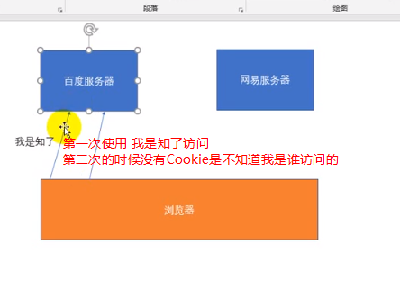

## session和cookie



浏览器会自动保存服务器的cookie信息。在浏览器network中可以请求头文件中查看。

1. cookie：在网站中，http请求是无状态的。也就是说即使第一次和服务器连接后并且登录成功后，第二次请求服务器依然不能知道当前请求是哪个用户。`cookie`的出现就是为了解决这个问题，第一次登录后服务器返回一些数据（cookie）给浏览器，然后浏览器保存在本地，当该用户发送第二次请求的时候，就会自动的把上次请求存储的`cookie`数据自动的携带给服务器，服务器通过浏览器携带的数据就能判断当前用户是哪个了。`cookie`存储的数据量有限，不同的浏览器有不同的存储大小，但一般不超过4KB。因此使用`cookie`只能存储一些小量的数据。
2. session: session和cookie的作用有点类似，都是为了存储用户相关的信息。不同的是，`cookie`是存储在本地浏览器，`session`是一个思路、一个概念、一个服务器存储授权信息的解决方案，不同的服务器，不同的框架，不同的语言有不同的实现。虽然实现不一样，但是他们的目的都是服务器为了方便存储数据的。`session`的出现，是为了解决`cookie`存储数据不安全的问题的。
3. cookie和session使用：`web`开发发展至今，`cookie`和`session`的使用已经出现了一些非常成熟的方案。在如今的市场或者企业里，一般有两种存储方式：
   - 存储在服务端：通过`cookie`存储一个`sessionid`，然后具体的数据则是保存在`session`中。如果用户已经登录，则服务器会在`cookie`中保存一个`sessionid`，下次再次请求的时候，会把该`sessionid`携带上来，服务器根据`sessionid`在`session`库中获取用户的`session`数据。就能知道该用户到底是谁，以及之前保存的一些状态信息。这种专业术语叫做`server side session`。`Django`把`session`信息默认存储到数据库中，当然也可以存储到其他地方，比如缓存中，文件系统中等。存储在服务器的数据会更加的安全，不容易被窃取。但存储在服务器也有一定的弊端，就是会占用服务器的资源，但现在服务器已经发展至今，一些`session`信息还是绰绰有余的。
   - 将`session`数据加密，然后存储在`cookie`中。这种专业术语叫做`client side session`。`flask`框架默认采用的就是这种方式，但是也可以替换成其他形式。

## 在django中操作cookie和session：

### 操作cookie：


#### 设置cookie：

设置`cookie`是设置值给浏览器的。因此我们需要通过`response`的对象来设置，设置`cookie`可以通过`response.set_cookie`来设置，这个方法的相关参数如下：

1. `key`：这个`cookie`的`key`。
2. `value`：这个`cookie`的`value`。
3. `max_age`：最长的生命周期。单位是秒。
4. `expires`：过期时间。跟`max_age`是类似的，只不过这个参数需要传递一个具体的日期，比如`datetime`或者是符合日期格式的字符串。如果同时设置了`expires`和`max_age`，那么将会使用`expires`的值作为过期时间。
5. `path`：对域名下哪个路径有效。默认是对域名下所有路径都有效。
6. `domain`：针对哪个域名有效。默认是针对主域名下都有效，如果只要针对某个子域名才有效，那么可以设置这个属性.
7. `secure`：是否是安全的，如果设置为`True`，那么只能在`https`协议下才可用。
8. `httponly`：默认是`False`。如果为`True`，那么在客户端不能通过`JavaScript`进行操作。

#### 删除cookie：

通过`delete_cookie`即可删除`cookie`。实际上删除`cookie`就是将指定的`cookie`的值设置为空的字符串，然后使用将他的过期时间设置为`0`，也就是浏览器关闭后就过期。

```python
def delete_cookie(request):
    response = HttpResponse('delete')
    response.delete_cookie('user_id')
    return response
```

#### 获取cookie：

获取浏览器发送过来的`cookie`信息。可以通过`request.COOKIES`来或者。这个对象是一个字典类型。比如获取所有的`cookie`，那么示例代码如下：

```python
cookies = request.COOKIES
for cookie_key,cookie_value in cookies.items():
   print(cookie_key,cookie_value)

#手打代码
#urls.py
from . import views
urlpatterns = [
    path('', views.index),
    path('list/', views.my_list),
    path('cms/', views.cms_view),
    path('cms/index', views.cms_view),#也是可以得到cookie的
]
#views.py
from django.http import HttpResponse
from datetime import datetime
from django.utils.timezone import make_aware
def index(request):
    response = HttpResponse('index')
    expires = datetime(year=2020,month=5,day=23,hour=18,minute=55,second=0)
    #response.set_cookie('username','zhiliao',max_age=180)
    expires = make_aware(expires)
    response.set_cookie('user_id','abc',expires=expires,path='/cms/')
    return response

def my_list(request):
    cookies = request.COOKIES  #获取cookies
    username = cookies.get('user_id')#当指定路径path时，就只有定义的路径才可以访问cookies
    return HttpResponse(username)
def cms_view(request):
    cookies = request.COOKIES
    user_id = cookies.get('user_id')
    return  HttpResponse(user_id)
```

------

### 操作session：


`django`中的`session`默认情况下是存储在服务器的数据库中的，在表中会根据`sessionid`来提取指定的`session`数据，然后再把这个`sessionid`放到`cookie`中发送给浏览器存储，浏览器下次在向服务器发送请求的时候会自动的把所有`cookie`信息都发送给服务器，服务器再从`cookie`中获取`sessionid`，然后再从数据库中获取`session`数据。但是我们在操作`session`的时候，这些细节压根就不用管。我们只需要通过`request.session`即可操作。示例代码如下：

```python
def index(request):
   request.session.get('username')
   return HttpResponse('index')
```

`session`常用的方法如下：

1. `get`：用来从`session`中获取指定值。
2. `pop`：从`session`中删除一个值。
3. `keys`：从`session`中获取所有的键。
4. `items`：从`session`中获取所有的值。
5. `clear`：清除当前这个用户的`session`数据。
6. `flush`：删除`session`并且删除在浏览器中存储的`session_id`，一般在注销的时候用得比较多。
7. `set_expiry(value)`：设置过期时间。
   - 整形：代表秒数，表示多少秒后过期。
   - `0`：代表只要浏览器关闭，`session`就会过期。
   - `None`：会使用全局的`session`配置。在`settings.py`中可以设置`SESSION_COOKIE_AGE`来配置全局的过期时间。默认是`1209600`秒，也就是2周的时间。
8. `clear_expired`：清除过期的`session`。`Django`并不会清除过期的`session`，需要定期手动的清理，或者是在终端，使用命令行`python manage.py clearsessions`来清除过期的`session`。

### 修改session的存储机制：

默认情况下，`session`数据是存储到数据库中的。当然也可以将`session`数据存储到其他地方。可以通过设置`SESSION_ENGINE`来更改`session`的存储位置，这个可以配置为以下几种方案：

1. `django.contrib.sessions.backends.db`：使用数据库。默认就是这种方案。
2. `django.contrib.sessions.backends.file`：使用文件来存储session。
3. `django.contrib.sessions.backends.cache`：使用缓存来存储session。想要将数据存储到缓存中，前提是你必须要在`settings.py`中配置好`CACHES`，并且是需要使用`Memcached`，而不能使用纯内存作为缓存。
4. `django.contrib.sessions.backends.cached_db`：在存储数据的时候，会将数据先存到缓存中，再存到数据库中。这样就可以保证万一缓存系统出现问题，session数据也不会丢失。在获取数据的时候，会先从缓存中获取，如果缓存中没有，那么就会从数据库中获取。
5. `django.contrib.sessions.backends.signed_cookies`：将`session`信息加密后存储到浏览器的`cookie`中。这种方式要注意安全，建议设置`SESSION_COOKIE_HTTPONLY=True`，那么在浏览器中不能通过`js`来操作`session`数据，并且还需要对`settings.py`中的`SECRET_KEY`进行保密，因为一旦别人知道这个`SECRET_KEY`，那么就可以进行解密。另外还有就是在`cookie`中，存储的数据不能超过`4k`。