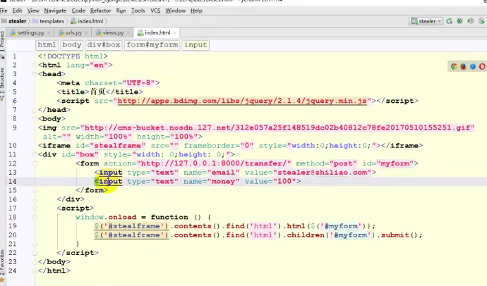



# CSRF攻击：

### CSRF攻击概述：

CSRF（Cross Site Request Forgery, 跨站域请求伪造）是一种网络的攻击方式，它在 2007 年曾被列为互联网 20 大安全隐患之一。其他安全隐患，比如 SQL 脚本注入，跨站域脚本攻击等在近年来已经逐渐为众人熟知，很多网站也都针对他们进行了防御。然而，对于大多数人来说，CSRF 却依然是一个陌生的概念。即便是大名鼎鼎的 Gmail, 在 2007 年底也存在着 CSRF 漏洞，从而被黑客攻击而使 Gmail 的用户造成巨大的损失。

### CSRF攻击原理：

网站是通过`cookie`来实现登录功能的。而`cookie`只要存在浏览器中，那么浏览器在访问这个`cookie`的服务器的时候，就会自动的携带`cookie`信息到服务器上去。那么这时候就存在一个漏洞了，如果你访问了一个别有用心或病毒网站，这个网站可以在网页源代码中插入js代码，使用js代码给其他服务器发送请求（比如ICBC的转账请求）。那么因为在发送请求的时候，浏览器会自动的把`cookie`发送给对应的服务器，这时候相应的服务器（比如ICBC网站），就不知道这个请求是伪造的，就被欺骗过去了。从而达到在用户不知情的情况下，给某个服务器发送了一个请求（比如转账）。

### 防御CSRF攻击：

CSRF攻击的要点就是在向服务器发送请求的时候，相应的`cookie`会自动的发送给对应的服务器。造成服务器不知道这个请求是用户发起的还是伪造的。这时候，我们可以在用户每次访问有表单的页面的时候，在网页源代码中加一个随机的字符串叫做`csrf_token`，在`cookie`中也加入一个相同值的`csrf_token`字符串。以后给服务器发送请求的时候，必须在`body`中以及`cookie`中都携带`csrf_token`，服务器只有检测到`cookie`中的`csrf_token`和`body`中的`csrf_token`都相同，才认为这个请求是正常的，否则就是伪造的。那么黑客就没办法伪造请求了。在`Django`中，如果想要防御`CSRF`攻击，应该做两步工作。第一个是在`settings.MIDDLEWARE`中添加`CsrfMiddleware`中间件。第二个是在模版代码中添加一个`input`标签，加载`csrf_token`。示例代码如下：

- 服务器代码：

  ```python
  MIDDLEWARE = [
    'django.middleware.security.SecurityMiddleware',
    'django.middleware.gzip.GZipMiddleware',
    'django.contrib.sessions.middleware.SessionMiddleware',
    'django.middleware.common.CommonMiddleware',
    'django.middleware.csrf.CsrfViewMiddleware',
    'django.contrib.auth.middleware.AuthenticationMiddleware',
    'django.contrib.messages.middleware.MessageMiddleware',
    'django.middleware.clickjacking.XFrameOptionsMiddleware'
  ]
  ```

- 模版代码：

  ```html
  <input type="hidden" name="csrfmiddlewaretoken" value="{{ csrf_token }}"/>
  ```

  或者是直接使用`csrf_token`标签，来自动生成一个带有`csrf token`的`input`标签：

  ```html
  
  ```

## 使用ajax处理csrf防御：

如果用`ajax`来处理`csrf`防御，那么需要手动的在`form`中添加`csrfmiddlewaretoken`，或者是在请求头中添加`X-CSRFToken`。我们可以从返回的`cookie`中提取`csrf token`，再设置进去。示例代码如下：

```javascript
function getCookie(name) {
    var cookieValue = null;
    if (document.cookie && document.cookie !== '') {
        var cookies = document.cookie.split(';');
        for (var i = 0; i < cookies.length; i++) {
            var cookie = jQuery.trim(cookies[i]);
            // Does this cookie string begin with the name we want?
            if (cookie.substring(0, name.length + 1) === (name + '=')) {
                cookieValue = decodeURIComponent(cookie.substring(name.length + 1));
                break;
            }
        }
    }
    return cookieValue;
}

var myajax = {
    'get': function (args) {
        args['method'] = 'get';
        this.ajax(args);
    },
    'post': function (args) {
        args['method'] = 'post';
        this._ajaxSetup();
        this.ajax(args);
    },
    'ajax': function (args) {
        $.ajax(args);
    },
    '_ajaxSetup': function () {
        $.ajaxSetup({
            beforeSend: function(xhr, settings) {
                if (!/^(GET|HEAD|OPTIONS|TRACE)$/.test(settings.type) && !this.crossDomain) {
                    xhr.setRequestHeader("X-CSRFToken", getCookie('csrftoken'));
                }
            }
        });
    }
};

$(function () {
    $("#submit").click(function (event) {
        event.preventDefault();
        var email = $("input[name='email']").val();
        var money = $("input[name='money']").val();

        myajax.post({
            'url': '/transfer/',
            'data':{
                'email': email,
                'money': money
            },
            'success': function (data) {
                console.log(data);
            },
            'fail': function (error) {
                console.log(error);
            }
        });
    })
});
```

### iframe相关知识：

1. ```
   iframe
   ```

   可以加载嵌入别的域名下的网页。也就是说可以发送跨域请求。比如我可以在我自己的网页中加载百度的网站，示例代码如下：

   ```html
   <iframe src="http://www.baidu.com/">
   </ifrmae>
   ```

2. 因为`iframe`加载的是别的域名下的网页。根据[同源策略](https://baike.baidu.com/item/同源策略/3927875?fr=aladdin)，`js`只能操作属于本域名下的代码，因此`js`不能操作通过`iframe`加载来的`DOM`元素。

3. 如果`ifrmae`的`src`属性为空，那么就没有同源策略的限制，这时候我们就可以操作`iframe`下面的代码了。并且，如果`src`为空，那么我们可以在`iframe`中，给任何域名都可以发送请求。

4. 直接在`iframe`中写`html`代码，浏览器是不会加载的。



