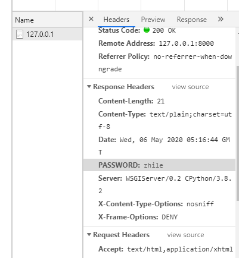

# HttpResponse对象

Django服务器接收到客户端发送过来的请求后，会将提交上来的这些数据封装成一个`HttpRequest`对象传给视图函数。那么视图函数在处理完相关的逻辑后，也需要返回一个响应给浏览器。而这个响应，我们必须返回`HttpResponseBase`或者他的子类的对象。而`HttpResponse`则是`HttpResponseBase`用得最多的子类。那么接下来就来介绍一下`HttpResponse`及其子类。

## 常用属性：

1、content：返回的内容。

```python
# response = HttpResponse()
# response.content='知了课堂'
response = HttpResponse('知了课堂1')
```

2、status_code：返回的HTTP响应状态码。

```python
response.status_code = 400
```

3、content_type：返回的数据的MIME类型，默认为`text/html`。浏览器会根据这个属性，来显示数据。如果是`text/html`，那么就会解析这个字符串，如果`text/plain`，那么就会显示一个纯文本。常用的`Content-Type`
如下：

- text/html（默认的，html文件）
- text/plain（纯文本）
- text/css（css文件）
- text/javascript（js文件）
- multipart/form-data（文件提交）
- application/json（json传输）
- application/xml（xml文件）

设置请求头：`response['X-Access-Token'] = 'xxxx'`。

```python
response = HttpResponse('<h1>知了课堂</h1>',content_type='text/plain;charset=utf-8')
#<h1>知了课堂</h1> 被当做普通的代码处理

#请求头
response['PASSWORD']='zhile'
```



## 常用方法：

1. set_cookie：用来设置`cookie`信息。后面讲到授权的时候会着重讲到。
2. delete_cookie：用来删除`cookie`信息。
3. write：`HttpResponse`是一个类似于文件的对象，可以用来写入数据到数据体（content）中。

```python
    response.write('知了')
    #<h1>知了课堂</h1>知了
    #用来写入content中
```

## JsonResponse类：

用来对象`dump`成`json`字符串，然后返回将`json`字符串封装成`Response`对象返回给浏览器。并且他的`Content-Type`是`application/json`。示例代码如下：

```python
from django.http import JsonResponse
def index(request):
    return JsonResponse({"username":"zhiliao","age":18})

###手打代码
from django.http import JsonResponse
import json
def jsonresponse_view(request):
    person ={
        'username':'zhiliao',
        'age':18,
        'height':170
    }
    person_str = json.dumps(person)
    response = HttpResponse(person_str,content_type='application/json')
    #return response #{"username": "zhiliao", "age": 18, "height": 170}

    #下面的代码是上面代码的缩写
    response = JsonResponse(person)
    return response #{"username": "zhiliao", "age": 18, "height": 170}
```

默认情况下`JsonResponse`只能对字典进行`dump`，如果想要对非字典的数据进行`dump`，那么需要给`JsonResponse`传递一个`safe=False`参数。示例代码如下：

```python
from django.http import JsonResponse
def index(request):
    persons = ['张三','李四','王五']
    return HttpResponse(persons)

```

以上代码会报错，应该在使用`HttpResponse`的时候，传入一个`safe=False`参数，示例代码如下：

```python
return HttpResponse(persons,safe=False)

###手打代码
from django.http import JsonResponse
import json
def jsonresponse_view(request):
    person =[
        {
            'username': 'zhiliao',
            'age': 18,
            'height': 170
        },
        {
            'username': 'zhiliao',
            'age': 20,
            'height': 172
        }

    ]
    person_str = json.dumps(person)
    response = HttpResponse(person_str,content_type='application/json')
    #return response #{"username": "zhiliao", "age": 18, "height": 170}

    #下面的代码是上面代码的缩写
    response = JsonResponse(person,safe=False)
    return response
#[{"username": "zhiliao", "age": 18, "height": 170}, {"username": "zhiliao", "age": 20, "height": 172}]

```