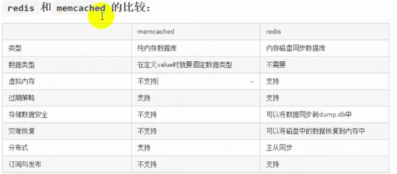
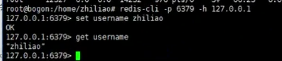

## redis使用场景

1、登录回话存储

2、排行版，计数器

3、作为消息队列

4、当前在线人数

5、一些常用的数据缓存，比如BBs论坛，板块不会经常变化

6、把前200片文章缓存或者评论缓存，一般用户浏览网站，只会浏览前面一部分文章或者评论，那么可以把前面200篇文章对应的评论缓存

7、好友关系：微博的好友关系使用redis

8、发布和订阅功能

### redis在ubuntu系统中的安装与启动

1、安装

`sudo apt-get install redis-server`

安装redis服务

2、卸载

`sudo apt-get purge --auto-remove redis-server`

3、启动：redis安装后，默认会自动启动，可以通过以下命令查看：

`ps auxigrep redis`

如果想自己手动启动，可以通过以下命令进行启动：

`sudo service redis-server start`

4、停止

`sudo serice redis-server stop`

### 对redis的操作

对redis的操作可以用两种方式，第一种方式采用redis-cli，第二种方式采用编程语言，比如Python、PHP和Java等

1、使用redis-cli对redis进行字符串操作

- 启动redis

`sudo service redis-server start`

- 链接上redis-server

`redis-cli -h [ip] -p 端口号 [host]`

如 `redis-cli -p  6370 -h 127.0.0.1`

  

- 添加

`set key value`

如·`set username xiaotou`

如果名字之间有空格 在设置值得时候，就需要添加空格

具体的去网站 www.redisdoc.com

  

  

  