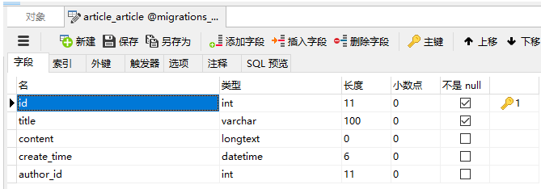

# ORM模型迁移

## 迁移命令：

1. makemigrations：将模型生成迁移脚本。模型所在的`app`，必须放在`settings.py`中的`INSTALLED_APPS`中。这个命令有以下几个常用选项：
   - app_label：后面可以跟一个或者多个`app`，那么就只会针对这几个app生成迁移脚本。如果没有任何的app_label，那么会检查`INSTALLED_APPS`中所有的app下的模型，针对每一个app都生成响应的迁移脚本。
```python
python manage.py makemigrations app_name
如果后面没有app_name将会执行所有的app
```
   - --name：给这个迁移脚本指定一个名字。

     ```python
     python manage.py makemigrations article --name "remove_article_content_createtime"
     ```

   - --empty：生成一个空的迁移脚本。如果你想写自己的迁移脚本，可以使用这个命令来实现一个空的文件，然后自己再在文件中写迁移脚本。
2. migrate：将新生成的迁移脚本。映射到数据库中。创建新的表或者修改表的结构。以下一些常用的选项：
   - app_label：将某个`app`下的迁移脚本映射到数据库中。如果没有指定，那么会将所有在`INSTALLED_APPS`中的`app`下的模型都映射到数据库中。
   
   - app_label migrationname：将某个`app`下指定名字的`migration`文件映射到数据库中。
   
   - `--fake`：可以将指定的迁移脚本名字添加到数据库中。但是并不会把迁移脚本转换为SQL语句，修改数据库中的表。
   
     数据库中没有但代码中有
   
     
   
     ```
     python manage.py  migrate article --fake
     ```
   
   - --fake-initial：将第一次生成的迁移文件版本号记录在数据库中。但并不会真正的执行迁移脚本。
   
     `python manage.py migrate article --fake-init`
   
> 执行migrate命令的时候报错的解决办法：
>
> 原因：
>
> 执行migrate命令会报错的原因是，数据库的'django_migrations'表中的迁移版本记录和代码中的迁移脚本不一致导致的。
>
> 解决办法：
>
> 使用--fake参数，首先对比数据库中迁移脚本和代码中的迁移脚本。然后找到那个不同，之后在使用--fake,将代码中迁移脚本添加到`django_migrations`中，但是并不会执行sql语句，这样就可以避免每次执行`migrate`的时候，都执行一些重复的迁移脚本。
>
> ***终极解决方案***
>
> 如果代码中迁移脚本和数据库中的迁移脚本实在太多，就是搞不清了。那么这时候就可以使用终极解决方案：
>
> 1、终极解决方案原理：就是将之前的那些迁移脚本都不用了，重新来过，要将出问题的app下的所有模型的字段，和数据库中相对应表的字段保持一致。重新映射。
>
> 2、将出问题的app下的所有模型，都和数据库中的表保持一致。
>
> 3、将出问题app下的所有迁移脚本文件都删掉，再在`django_migrations`将出问题的app相关的迁移记录都删掉。
>
> 4、使用`makemigrations`重新将模型生成一个迁移脚本。
>
> 5、使用`migrate --fake-init`参数，将刚刚生成的迁移脚本，标记为已经完成（因为这些模型相对应的表，其实都已经在数据库中存在，不需要重新填写。
3. `showmigrations`：查看某个app下的迁移文件。如果后面没有app，那么将查看`INSTALLED_APPS`中所有的迁移文件。
4. sqlmigrate：查看某个迁移文件在映射到数据库中的时候，转换的`SQL`语句。

## migrations中的迁移版本和数据库中的迁移版本对不上怎么办？

1. 找到哪里不一致，然后使用`python manage.py --fake [版本名字]`，将这个版本标记为已经映射。
2. 删除指定`app`下`migrations`和数据库表`django_migrations`中和这个`app`相关的版本号，然后将模型中的字段和数据库中的字段保持一致，再使用命令`python manage.py makemigrations`重新生成一个初始化的迁移脚本，之后再使用命令`python manage.py makemigrations --fake-initial`来将这个初始化的迁移脚本标记为已经映射。以后再修改就没有问题了。

更多关于迁移脚本的。请查看官方文档：https://docs.djangoproject.com/en/2.0/topics/migrations/

## 根据已有的表自动生成模型：

在实际开发中，有些时候可能数据库已经存在了。如果我们用`Django`来开发一个网站，读取的是之前已经存在的数据库中的数据。那么该如何将模型与数据库中的表映射呢？根据旧的数据库生成对应的`ORM`模型，需要以下几个步骤：

1. `Django`给我们提供了一个`inspectdb`的命令，可以非常方便的将已经存在的表，自动的生成模型。想要使用`inspectdb`自动将表生成模型。首先需要在`settings.py`中配置好数据库相关信息。不然就找不到数据库。示例代码如下：

   ```python
    DATABASES = {
        'default': {
            'ENGINE': 'django.db.backends.mysql',
            'NAME': "migrations_demo",
            'HOST': '127.0.0.1',
            'PORT': '3306',
            'USER': 'root',
            'PASSWORD': 'root'
        }
    }
   ```

   比如有以下表：

   - article表：
     

   - tag表：
     

   - article_tag表：
     

   - front_user表：
     

     那么通过`python manage.py inspectdb`，就会将表转换为模型后的代码，显示在终端：

     ```python
     from django.db import models
     
     class ArticleArticle(models.Model):
       title = models.CharField(max_length=100)
       content = models.TextField(blank=True, null=True)
       create_time = models.DateTimeField(blank=True, null=True)
       author = models.ForeignKey('FrontUserFrontuser', models.DO_NOTHING, blank=True, null=True)
     
       class Meta:
           managed = False
           db_table = 'article_article'
     
     class ArticleArticleTags(models.Model):
       article = models.ForeignKey(ArticleArticle, models.DO_NOTHING)
       tag = models.ForeignKey('ArticleTag', models.DO_NOTHING)
     
       class Meta:
           managed = False
           db_table = 'article_article_tags'
           unique_together = (('article', 'tag'),)
     
     class ArticleTag(models.Model):
       name = models.CharField(max_length=100)
     
       class Meta:
           managed = False
           db_table = 'article_tag'
     
     class FrontUserFrontuser(models.Model):
       username = models.CharField(max_length=100)
       telephone = models.CharField(max_length=11)
     
       class Meta:
           managed = False
           db_table = 'front_user_frontuser'
     ```

     以上代码只是显示在终端。如果想要保存到文件中。那么可以使用`>`重定向输出到指定的文件。比如让他输出到`models.py`文件中。示例命令如下：

     ```shell
     python manage.py inspectdb > models.py
     ```

     以上的命令，只能在终端执行，不能在`pycharm->Tools->Run manage.py Task...`中使用。

     如果只是想要转换一个表为模型。那么可以指定表的名字。示例命令如下：

     ```shell
     python manage.py inspectdb article_article > models.py
     ```

2. 修正模型：新生成的`ORM`模型有些地方可能不太适合使用。比如模型的名字，表之间的关系等等。那么以下选项还需要重新配置一下：

   - 模型名：自动生成的模型，是根据表的名字生成的，可能不是你想要的。这时候模型的名字你可以改成任何你想要的。

   - 模型所属app：根据自己的需要，将相应的模型放在对应的app中。放在同一个app中也是没有任何问题的。只是不方便管理。

   - 模型外键引用：将所有使用`ForeignKey`的地方，模型引用都改成字符串。这样不会产生模型顺序的问题。另外，如果引用的模型已经移动到其他的app中了，那么还要加上这个app的前缀。

   - 让Django管理模型：将`Meta`下的`managed=False`删掉，如果保留这个，那么以后这个模型有任何的修改，使用`migrate`都不会映射到数据库中。

   - 当有多对多的时候，应该也要修正模型。将中间表注视了，然后使用`ManyToManyField`来实现多对多。并且，使用`ManyToManyField`生成的中间表的名字可能和数据库中那个中间表的名字不一致，这时候肯定就不能正常连接了。那么可以通过`db_table`来指定中间表的名字。示例代码如下：

     ```python
     class Article(models.Model):
      title = models.CharField(max_length=100, blank=True, null=True)
      content = models.TextField(blank=True, null=True)
      author = models.ForeignKey('front.User', models.SET_NULL, blank=True, null=True)
      # 使用ManyToManyField模型到表，生成的中间表的规则是：article_tags
      # 但现在已经存在的表的名字叫做：article_tag
      # 可以使用db_table，指定中间表的名字
      tags = models.ManyToManyField("Tag",db_table='article_tag')
     
      class Meta:
          db_table = 'article'
     ```

   - 表名：切记不要修改表的名字。不然映射到数据库中，会发生找不到对应表的错误。

3. 执行命令`python manage.py makemigrations`生成初始化的迁移脚本。方便后面通过`ORM`来管理表。这时候还需要执行命令`python manage.py migrate --fake-initial`，因为如果不使用`--fake-initial`，那么会将迁移脚本会映射到数据库中。这时候迁移脚本会新创建表，而这个表之前是已经存在了的，所以肯定会报错。此时我们只要将这个`0001-initial`的状态修改为已经映射，而不真正执行映射，下次再`migrate`的时候，就会忽略他。

4. 将`Django`的核心表映射到数据库中：`Django`中还有一些核心的表也是需要创建的。不然有些功能是用不了的。比如`auth`相关表。如果这个数据库之前就是使用`Django`开发的，那么这些表就已经存在了。可以不用管了。如果之前这个数据库不是使用`Django`开发的，那么应该使用`migrate`命令将`Django`中的核心模型映射到数据库中。

5. 验证数据表

   ```python
   def index(request):
       # article = Article(title='abc',content='1234')
       # author = User.objects.create(username='zhiliao',password='12334')
       # article.author = author
       # article.save()
       article =Article.objects.first()
       tag1 = Tag.objects.create(name='python')
       tag2 = Tag.objects.create(name='php')
       article.tags.add(tag1,tag2)
       article.save()
   
       return HttpResponse('success')
   ```

   