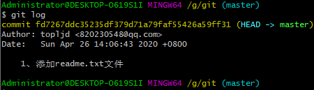

### git的使用教程

> 安装地址：http://git-scm.com


> 1、安装完之后，右键`git bash here` 输入`git --version`


当看到版本号的时候，说明已经安装成功。

> 2、设置用户名和邮箱，尽量和github账号一致

```auto
git config --global user.name topljd(您的用户名)
git config --global user.email 820230548@qq.com(您的邮箱)
```


> 3、创建工作区，在文件夹内右键 git bash


创建工作区的时候，要在想要创建的文件夹内！

`如果我要在G:\git下创建工作区`，.git是隐藏的文件夹，里面的文件不用管就可以了！


> git的使用，举例

- 1、创建readme.txt文件，并增加到缓存区

  ```auto
  git add readme.txt //将readme.txt这个文件增加到 暂存区
  git add .          //这个 点 表示当前目录下的所有文件
  ```
  
- 2、commit提交到版本区

  ```auto
  git commit -m "1、添加readme.txt文件"  //后面引号内的内容为 注释
  ```


- 3、推送到远程的服务器

  ```auto
  git remote add origin https://github.com/topljd/blog.git	远程连接仓库
  git push -u origin master		推送到服务器
  ```
  
  

- 4、其他
```
  git log		//查看记录
```

  

  ```auto
  git status		//查看当前状态
  ```

  

#### 二、在github上创建服务器

github地址，注册账号 地址：`https://github.com`

- 创建仓库

  ```git
  //create a new repository on the command line
  git init		创建git项目
  git add readme.txt		将版本说明添加到 暂存库
  git commit -m 'first commit'	提交到版本库，后面的为说明注释
  git remote add origin https://github.com/topljd/blog.git	远程连接仓库
  git push -u origin master		推送到服务器
  ```

- `git log`

  

  `git log --pretty=online 6a59ff31`  //查看版本

  `git reset --hard 6a59ff31`	//回滚到某个版本

#### git使用常见的问题

**1、提交不了的时候，显示 入校错误！**

```auto
failed to push some refs to 'https://github.com/topljd/studynote.git'
hint: Updates were rejected because the remote contains work that you do
hint: not have locally. This is usually caused by another repository pushing
hint: to the same ref. You may want to first integrate the remote changes
hint: (e.g., 'git pull ...') before pushing again.
hint: See the 'Note about fast-forwards' in 'git push --help' for details.
```

答：因为此时版本中没有给readme.txt文件，解决办法

可以通过如下命令进行代码合并【注：pull=fetch+merge]

```
git pull --rebase origin master
```


此时将会把库里的文件下载到本地当前文件夹！

然后在进行提交

```
git push -m study master
```

**2、如何删除github项目**


点击setting


找到Danger Zone最下买你的`delete this repository`


确认是否真的要删除！

**3、如何删除github库里面的某个文件**


