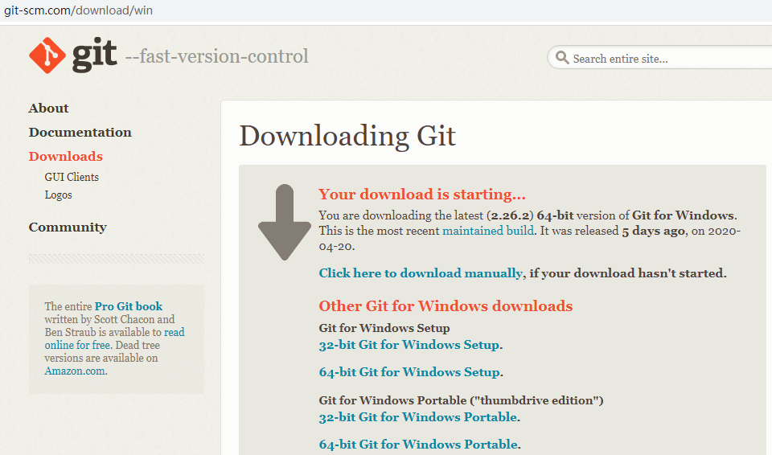
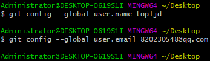
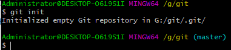
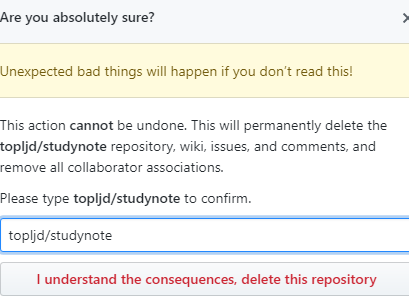
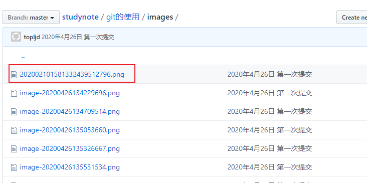
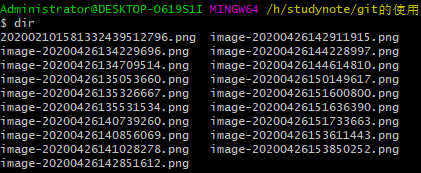
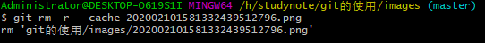
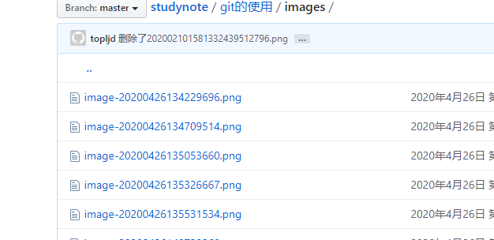
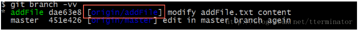
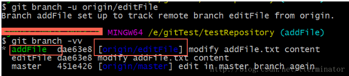

### git的使用教程

> 安装地址：http://git-scm.com



> 1、安装完之后，右键`git bash here` 输入`git --version`


当看到版本号的时候，说明已经安装成功。

> 2、设置用户名和邮箱，尽量和github账号一致

```auto
git config --global user.name topljd(您的用户名)
git config --global user.email 820230548@qq.com(您的邮箱)
```



> 3、创建工作区，在文件夹内右键 git bash


创建工作区的时候，要在想要创建的文件夹内！

`如果我要在G:\git下创建工作区`，.git是隐藏的文件夹，里面的文件不用管就可以了！



> git的使用，举例

- 1、创建readme.txt文件，并增加到缓存区

  ```auto
  git add readme.txt //将readme.txt这个文件增加到 暂存区
  git add .          //这个 点 表示当前目录下的所有文件
  ```
  
- 2、commit提交到版本区

  ```auto
  git commit -m "1、添加readme.txt文件"  //后面引号内的内容为 注释
  ```


- 3、推送到远程的服务器

  ```auto
  git remote add origin https://github.com/topljd/blog.git	远程连接仓库
  git push -u origin master		推送到服务器
  ```
  
  

- 4、其他
```
  git log		//查看记录
```

  

  ```auto
  git status		//查看当前状态
  ```

  

#### 二、在github上创建服务器

github地址，注册账号 地址：`https://github.com`

- 创建仓库

  ```git
  //create a new repository on the command line
  git init		创建git项目
  git add readme.txt		将版本说明添加到 暂存库
  git commit -m 'first commit'	提交到版本库，后面的为说明注释
  git remote add origin https://github.com/topljd/blog.git	远程连接仓库
  git push -u origin master		推送到服务器
  ```

- `git log`

  

  `git log --pretty=online 6a59ff31`  //查看版本

  `git reset --hard 6a59ff31`	//回滚到某个版本

#### git使用常见的问题

**1、提交不了的时候，显示 入校错误！**

```auto
failed to push some refs to 'https://github.com/topljd/studynote.git'
hint: Updates were rejected because the remote contains work that you do
hint: not have locally. This is usually caused by another repository pushing
hint: to the same ref. You may want to first integrate the remote changes
hint: (e.g., 'git pull ...') before pushing again.
hint: See the 'Note about fast-forwards' in 'git push --help' for details.
```

答：因为此时版本中没有给readme.txt文件，解决办法

可以通过如下命令进行代码合并【注：pull=fetch+merge]

```
git pull --rebase origin master
```


此时将会把库里的文件下载到本地当前文件夹！

然后在进行提交

```
git push -m study master
```

**2、如何删除github项目**


点击setting


找到Danger Zone最下买你的`delete this repository`



确认是否真的要删除！

**3、如何删除github库里面的某个文件**

因为在github上不能直接删除某个文件，所以必须用git命令去删除，在上传的的项目文件里打开git，找到要删除的文件。`202002101581332439512796.png`



- `git pull --rebase origin master`或者`git pull origin master`将github上的额文件重新拉下来，其中origin是别名，master是分支。

  

- 然后输入命令`dir`查看目录下的而文件，如下图：

  

- 再输入命令`git rm -r --cache 202002101581332439512796.png `删除磁盘上的该图片

  

- 再输入`git commit -m '删除了202002101581332439512796.png'`提交添加说明如下图：

  

- 最后输入`git push -u origin master`更新github仓库，如下图：

  

  

  文件已经被删除了！

  **4、当出现master warning: LF will be replaced by CRLF in www/css/style.css.>**

  ```auto
  git config --global core.autocrlf false
  ```

  一般的还是远程仓库中的文件与本地的文件不一样，需要先将远程仓库中的代码拉去到本地种！
  
  5、创建分支
  
  ```
  $ git checkout -b iss53
  Switched to a new branch "iss53"
  上面是下面的简写
  $ git branch iss53
  $ git checkout iss53
  ```
  

> 6、出现上传不了错误提示如下：
>
> ​	error: cannot pull with rebase: You have unstaged changes.
> ​	error: please commit or stash them.

解决办法：

1.git pull –rebase 理解

这个命令做了以下内容：
a.把你 commit 到本地仓库的内容，取出来放到暂存区(stash)（这时你的工作区是干净的）
b.然后从远端拉取代码到本地，由于工作区是干净的，所以不会有冲突
c.从暂存区把你之前提交的内容取出来，跟拉下来的代码合并

所以 rebase 在拉代码前要确保你本地工作区是干净的，如果你本地修改的内容没完全 commit 或者 stash，就会 rebase 失败。

2.还是要听 git 提示的话，要理智，有什么不清楚的，就输入
git status
根据人家提示的来，该提交的提交，stash 的 stash。

3.删除文件后需要 git add -A, 光 git add. 不行，区别如下：

```
git add 的几种参数区别
git add -A 保存所有的修改
git add . 保存新的添加和修改，但是不包括删除
git add -u 保存修改和删除，但是不包括新建文件。
```

> 7、切换分支的时候里面本地文件夹中的文件也会发生变化


> 8、名字和分支的用法


> 9、git删除本地分支、删除远程分支

1、查看所有分支

`git branch -a`

```shell
$ git branch -a
  coding-pages
  gh-pages
* master    # * 表示当前分支
# 下面是远程分支
  remotes/origin/gh-pages
  remotes/origin/master
  remotes/origin_coding/coding-pages
  remotes/origin_coding/master
  remotes/origin_gitee/master
  ########
  $ git branch -r #查看远程分支
  origin/gh-pages
  origin/master
  origin_coding/coding-pages
  origin_coding/master
  origin_gitee/master
```

2、查看当前所在分支

`git branch`

3、删除本地的XXX分支

`git branch -d XXX`

4、删除远程的XXX分支

`git push origin --delete XXX`远程的话一般是双`-`

> 10、拉取远程分支并创建本地分支

1、`git checkout -b 本地分支名x origin/远程分支名x`

使用该方式会在本地新建分支x，并自动切换到该本地分支x。

2、`git fetch origin 远程分支名x:本地分支名x`

使用该方式会在本地新建分支x，但是不会自动切换到该本地分支x，需要手动checkout。

3、`git branch -vv`**查看本地分支与远程分支映射关系**

```shell
$ git branch -vv
  coding-pages df545e4 [origin/coding-pages: gone] 删除所有pages文件
  gh-pages     6d2697e [origin/gh-pages] 2020年5月7日10:42:39
* master       cdb916a [origin_coding/master: ahead 1] 2020年5月7日10:26:37 提交ignore
```

4、`git branch -u origin/addFile`或`git branch --set-upstream-to origin/addFile`建立当前分支与远程分支的映射。


查看当前本地分支与远程分支映射关系结果如下：



此时再次拉取，成功信息如下：

`git pull`

```
Already up-to-date
```

再次推送，成功信息如下：

`git push`

```
Everything up-to-date
```

5、撤销本地分支与远程分支的映射关系

`git branch --unset-upstream`使用`git branch -vv`查看映射关系


6、可以本地分支A名和远程分支B名建立映射关系



并且此时可以把本地分支A提交到分支B分支中去：


>  11、failed to push some refs  当push上传不了出现如下提示的时候


解决方案：远程仓库与本地仓库代码不一样，上传不了！（远程仓库有其他的文件)

方法：1、`git pull origin master`将远程文件拉取到本地。再次执行`git add .`等系列动作上传。此时一切正常！

