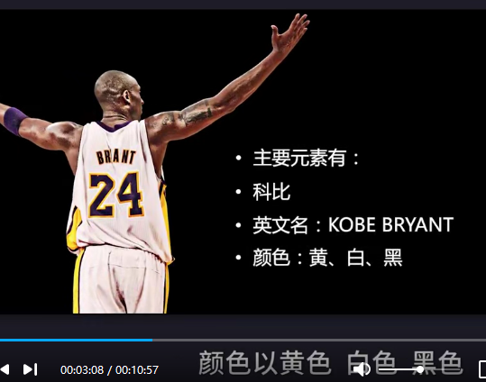
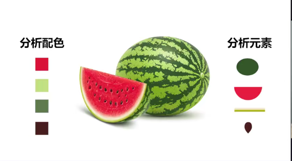
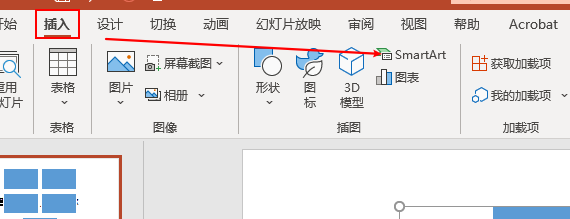
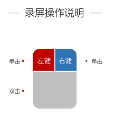
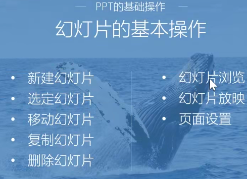

## 理念与操作篇

#### 001为什么说PPT是职场人必须技能

实战 趣味 风骚的课程。80%按钮都不会用的。

一天拨打100个3分钟以上有效电话。

##### 七大篇章

- 理念与操作篇
- 必学功能篇
- 格调提升篇
- 使用场景化
- 疑难杂症与心得分享
- 从策划的角度构思PPT

思考->策划->设计->演绎->商务PPT

人性。。。策划的思维

微软PPT2016版本。

ppt的后缀名字是.ppt或者.pptx

演示文件叫做ppt

金句为之助力。

#### 002 我们为什么都做不好PPT

1、做PPT需要审美

抠图功能。

分析素材的颜色元素。

对于句子情景的想象场景。

四个层次：艳俗 矫情 含蓄 病态（美的最高境界)

工具和操作。

四个对美的关键：

`多看 多想 多仿 多讲`

类型：阅读型(企业介绍等)  演讲型（商务汇报 演讲课件)

时间是最伟大的魔术师。

#### 003常用幻灯片软件对比

壁画 演讲 漫画 投影仪 1987年ppt诞生了。

`keynote` 简单不少，流畅很多

`Prezi `一张大的图，更具有连续的画面

`PowerPoint`微软

`wps`国产金山软件 体积小

#### 004 PPT是编剧、设计师、演员三个角色的统一

抓住小朋友的心，做一个好好的编剧。匠心

八大要素：

- 思 

  明确目标 

  观点是否清晰

  如何打动人
  
- 简

- 真

- 美

- 惊

- 气

微笑是演讲过程中，必不可少的武器。

- 叹
- 省

你站久了，舞台就是你的了！

#### 005PPT制作四大误区与优秀标准

第一个误区：ppt的word话

误区2：逻辑层面的混沌不清（金字塔原理)

误区3：沟通层面（自我为中心）

用大白话说明你的观点。

误区4：技术层面上的粗制乱造

#### 006 正确制作PPT的顺序

先搭框架 再写文页

①明确主题意图

②分析听众（思维导图)

③动手制作

- 确认幻灯片尺寸

- 精简PPT文字稿

- 确定风格

  设计风格 演说风格

④寻找素材

⑤制作幻灯片demo

⑥沟通交流修改幻灯片

⑦检查和定稿

#### 007 快速掌握PPT基础

SmartArt：

格式刷的使用：

形状透明度蒙版的使用：

幻灯片母版：

切换与基本动画：

动画刷的使用：

#### 008 素材类操作让PPT骨肉丰满

取色器的使用：

编辑顶点：

ctrl+shift复制更快

ctrl+alt

布尔运算：格式 合并形状里面 形状的裁剪

演示者视图：右键

PPT分节设置

#### 009 PPT特色新功能开启全新世界

插入类对象：

插入文字 

插入形状

图标和表格

插入音乐和视频

**快速对齐**

增加撤销次数  文件 选项 高级 最多可取消次数

更改界面颜色

自定义快速工具栏

文字和形状的区别

保存设置

缩略图选项

 #### 010巩固与实操 做出这份PPT

将word文档，提炼套用模板！

