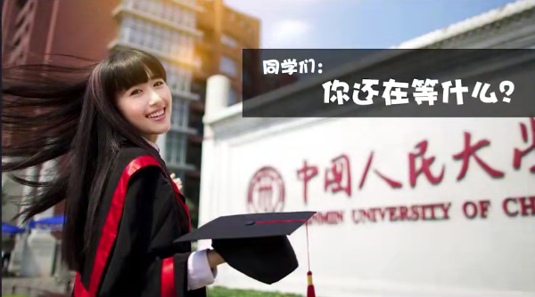
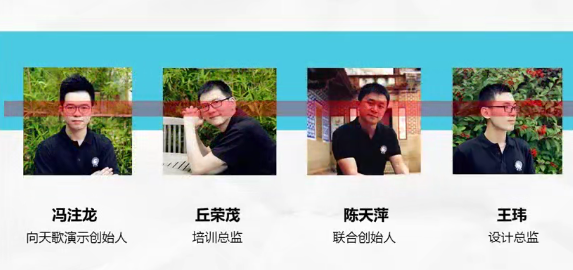
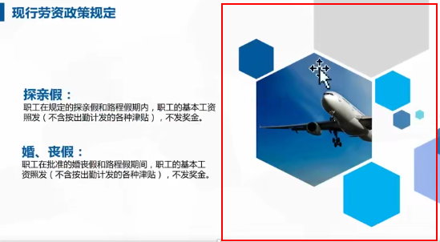
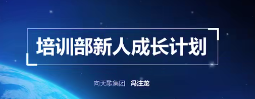
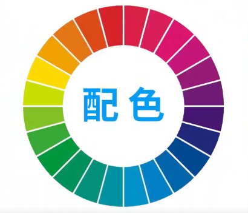
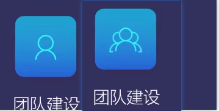
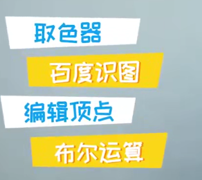

### 必学功能

##### 字体

1、识别太难看不懂

2、爱用特效土又怂

3、缺失字体心绞痛

微软雅黑 宋体纤细

尽量使用微软雅黑字体。是万能的选择

微软雅黑light也是非常棒的字体。

##### 011文字的基本设置

字体安装：

汉仪小麦体 下载 右键安装

求字体qiuziti.com分析字体叫什么名字。

##### 012 气质的营造 其实字体是很美的

方正超粗黑简体

细的字体，在表现细节上质感。

康熙字体 ，华康海报体

书法字体具有设计感和表现力

字体选择因素:

1、气质和使用和场景

推荐几款：

中国风：禹卫书法行书简体  叶根友行书简体 造字工房力黑

文鼎霹雳体 汉仪小麦体 华康俪金黑

思源宋体

房门正道标题体

微软雅黑

①字体混搭法

②素材修饰法

③大小对比法

特殊字体的保存方法：

工具 保存选项 嵌入字体

将字体变为图片

形状 布尔运算

##### 013 好图片的定义与寻找

四个错误：

①图片变形

②水印图片

③模糊不清

④图文不符

三大原则：

高清无码气质

符合主题

高清无码

符合气质

一、百度图片 辅助功能（类似图片 高清图片)

pixabay.com免费图片搜索

pexels.com

刻印用引文试试

sc.chinaz.com

www.bieyang.info

好的图片随手保存。做好分类。

百度识图

##### 014快速蜕变 解锁用好图片的各种姿势

如何使用小图，拼装法；

通过布尔做出形状

贴边

裁剪

2、如何使用大图

留白多的，把字放在留白区域

眼睛在同一条直线。

1、纯色填充法（图片背景纯色)

2、图片修饰法：

手机电脑素材，精品图标。

3、蒙版法

格调提升，案例提升法

> 关于图片的基本操作

图片效果。模糊功能

删除背景，双击删除背景（背景颜色比较存的)

压缩图片 双击 压缩图片

超级妙招，图片无缝拉伸

复制图片裁剪，拉伸红色区域。

##### 015形状让你的PPT千变万化

线条 形状的作用：

①导航仪原则

②三八线原则

③点睛原则

利用线条进行升级

- 编辑顶点

- 渐变设置（右键 设置形状格式）渐变光照

  uigradients.com渐变网站

- 蒙版

配色尽量从图片中选色。

##### 016 配色 你也能是PPT定制级大师

配色认知：

一、颜色杂乱

二、饱和度太高

三、脱离具体使用情景

1、颜色要看得见

2、颜色要少

想到黄色的建设帽

好的配色：公司VI系统配色，结合了公司的企业文化。

行业有行业的配色。医疗 党政 科技等

colorhunt.co

materialpalette.com配色网站

花瓣网搜索配色

##### 017 图标 小图标让你嗖嗖大变化

①吻合主题

②图标要统一

图标有没有框啊，线性图标

第三个和第四个不是线性图标，整体有点差

③图标透明底

阿里巴巴矢量图标库

iconfont.com搜索下载等

Ai软件加工图标

##### 018巩固与实操作 看到好设计如何为我所用

没有准备 

技巧小复盘

花瓣网

