## 03格调提升

#### 019 PPT设计中的常见误区

**四大误区**

- 认知层面
- 逻辑层面
- 沟通层面
- 技术层面

操作类 文字类 图片类 配色类 排版类 形状类

①操作类

文件不命名（时间版本）

图片不压缩（切记保留图片的高清版)

字体缺失

②文字类

不要再用下划线，斜体

字体特效

③图片

滥用3D小人

加gif图片

图片模糊

图片变形

图片带水印

④配色类

渐变没有章法

颜色非常刺眼

字体与颜色太接近

颜色太多

⑤排版类

不对齐

不排版

留白，让PPT有更多的呼吸空间

⑥形状类

形状变形

形状夸张

形状太小

形状带边框

很多错误在PPT一页中是同时存在的。

大部人做PPT其实是不知道自己做的PPT是很糟糕的。

#### 020设计原理 设计中的八字金诀与应用

对齐 对比 聚拢 重复

一齐遮百丑

粗细 大小 色彩的对比

实际的案例：

#### 021 留白 令人怦然心动的美感

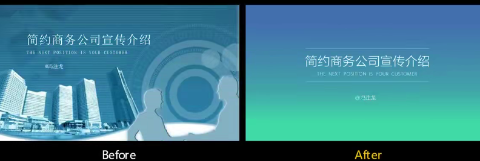

#### 022笔刷 PS的效果PPT也能做

布尔运算怎么做；

#### 023 专业与高效都给您 逻辑图标与SmartArt

并列式 图标 手绘 素材法

总分式

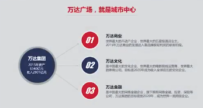

时间轴

IMPACT字体

两个圆的重叠技巧会经常用到。

#### 024数据图标的应用及美化之道

3招图标大招

准确不能手绘

折线图用实线

有重叠增加透明度

②删

删背景 

删表格线

③配色

一页PPT给出你的观点，一定要给出你的结论。

数据和图表要给大家的结论。

#### 025 表格可不止行和列那么简单

表格排版术的使用

- 常见错误：

1、使用宋体

2、字号太小

3、不注重对齐

4、颜色过多

5、边框粗细不一

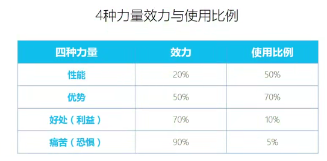

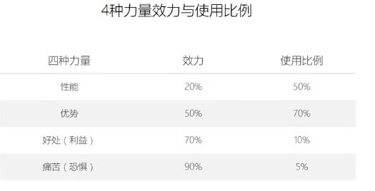

案例详解：

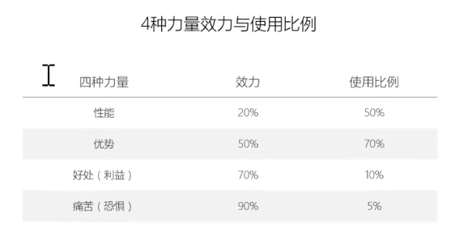

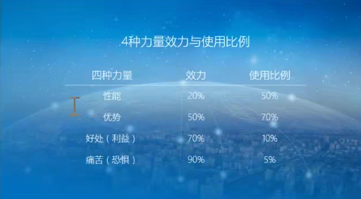

先给图片上一层蒙版，渐变蒙版

插入表格，填充图片，修改颜色。

将表格切开，剪切 选择性粘贴 增强型粘贴。

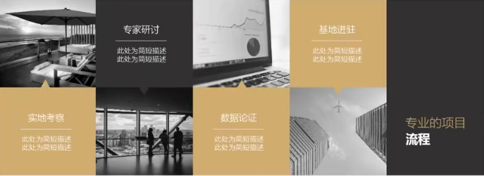

#### 026 拯救你的黑眼圈 如何优雅的套用模板

officeplus.cn

docer.com

www.yanj.cn

PPT模板网站

好看 好用  舒服

扁平化 PPT

> 5个套用模板的技巧

配合自己的行业

注意字体

运用布尔运算

字号

乱搭素材

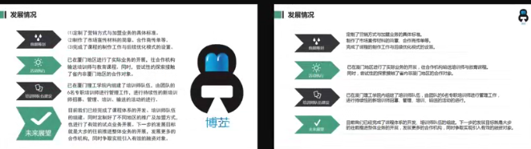

对齐和配色

先删统一字号别乱加素材，干净舒服、

注意提炼文案

利用快捷方式 格式刷

默认文本框的设置。

文字提案特别的重要。

#### 027排版1 文字多怎么办？

第一个 拆

第二个 找

第三个 拼

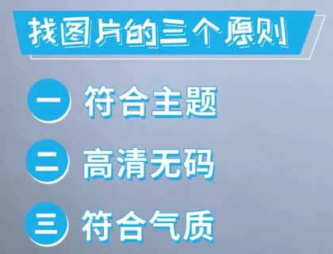

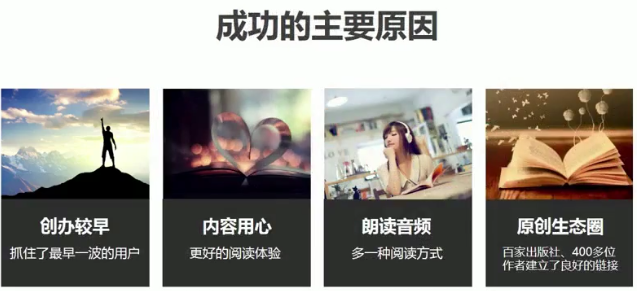

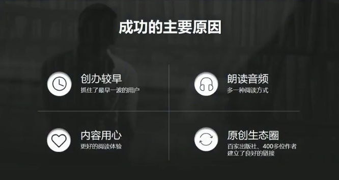

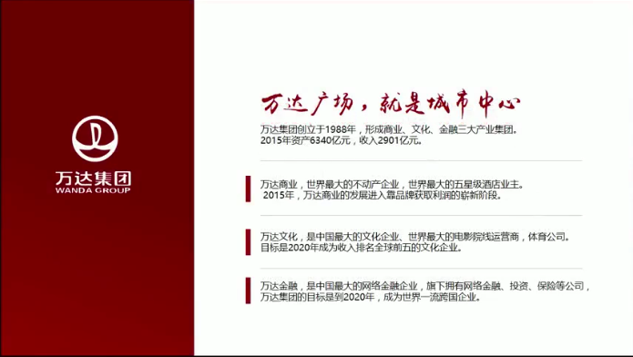

#### 028 排版2 图片多怎么办

平铺法：

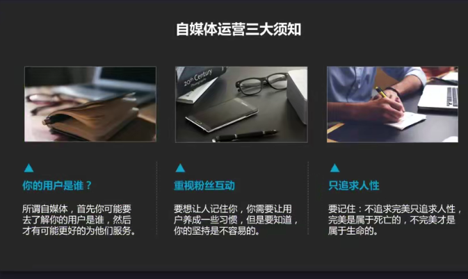

堆砌法：

修饰法：

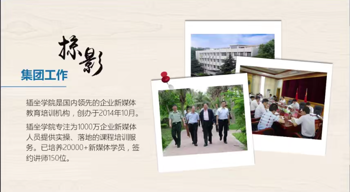

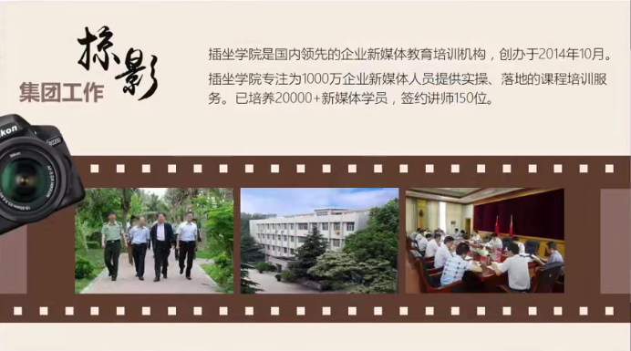

F4重复上次动作。全部选中对齐。图片删除背景。

#### 029 排版3 一张图怎么排版

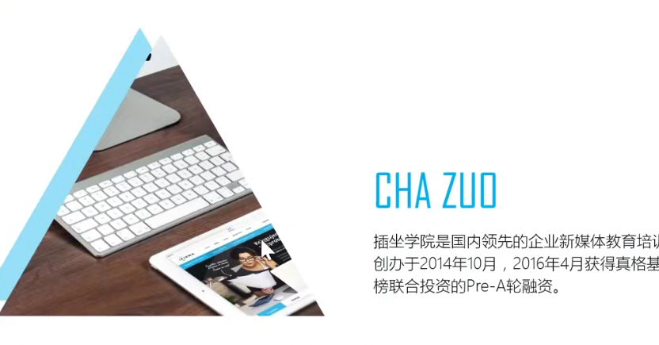

#### 030 巩固与实操作 做出这一份PPT

V1的版本套用模板，V2版本

