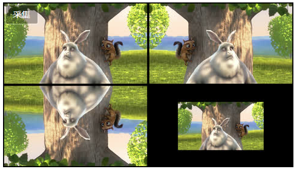

## MoviePy - 中文文档

```auto
    MoviePy是一个用于视频编辑的python模块，你可以用它实现一些基本的操作(比如视频剪辑，视频拼接，插入标题),还可以实现视频合成，还有视频处理，抑或用它加入一些自定义的高级的特效。总之，它的功能还是蛮丰富的。此外，MoviePy可以读写绝大多数常见的视频格式，甚至包括GIF格式！是不是很兴奋呢？基于Python2.7以上的版本，MoviePy可以轻松实现跨平台，Mac/Windows/Linux统统没问题，这也以意味着，MoviePy项目可以部署到服务端，在服务端进行视频处理。真是福音啊！
```

> 1、下载和安装

1、环境确认（需要python 2.7以上）

2、安装MoviePy

a、`pip install moviepy`

如果没有setup.py和setup_tools会安装失败，现在可以先执行

`pip install moviepy`

b、手动安装

可以在PYPI或者Github下载源码 解压到目录下

3、环境介绍

MoviePy 依赖的python库有 [Numpy](https://www.scipy.org/install.html), [imageio](https://imageio.github.io/), [Decorator](https://pypi.python.org/pypi/decorator), 和 [tqdm](https://pypi.python.org/pypi/tqdm)这些都会在安装MoviePy的时候自动安装.

> 2、快速上手MoviePy

```auto
    在一个MoviePy脚本中，我们可以加载视频和音频，然后修改它们，将他们合并，然后把最终结果写入到一个新的文件中。下面的例子，加载视频，在视频中间添加一个标题显示10秒钟，然后把结果写入到一个新的文件内。
```

```python
# 导入需要的库
from moviepy.editor import *
 
# 从本地载入视频myHolidays.mp4并截取00:00:02 - 00:00:09部分
clip = VideoFileClip("myHolidays.mp4").subclip(2,9)
 
# 调低音频音量 (volume x 0.8)
clip = clip.volumex(0.8)
 
# 做一个txt clip. 自定义样式，颜色.
txt_clip = TextClip("My Holidays 2013",fontsize=70,color='white')
 
# 文本clip在屏幕正中显示持续10秒
txt_clip = txt_clip.set_pos('center').set_duration(10)
 
# 把 text clip 的内容覆盖 video clip
video = CompositeVideoClip([clip, txt_clip])
 
# 把最后生成的视频导出到文件内
video.write_videofile("myHolidays_edited.webm")
```

#### 视频叠加和视频拼接

​        简单地把多个视频合成到一起的两种最简单的办法。1.把视频一个接一个地拼接起来。2.视频叠加在一块，比如一个大的画面同时播几个视频。

​       视频拼接我们使用concatenate_videoclips函数来完成。

```python
from moviepy.editor import VideoFileClip, concatenate_videoclips
 
clip1 = VideoFileClip("myvideo.mp4")
clip2 = VideoFileClip("myvideo2.mp4").subclip(50,60)#这个表示从50秒到60秒
clip3 = VideoFileClip("myvideo3.mp4")
 
finalclip = concatenate_videoclips([clip1, clip2, clip3])
finalclip.write_videofile("my_concatenate.mp4")
```

finalclip会按照clip1，clip2，clip3的顺序将这三个clip播放。这些clip并不需要相同的时长或者大小，仅仅是首尾相连而已。我们还可以通过transition=my_clip这个参数来设置一下clip之间衔接的过渡动画。

视频叠加我们使用clip_array函数来完成

```python
from moviepy.editor import VideoFileClip, clips_array, vfx
 
clip1 = VideoFileClip("myvideo.mp4").margin(10)
clip2 = clip1.fx(vfx.mirror_x)#x轴镜像
clip3 = clip1.fx(vfx.mirror_y)#y轴镜像
clip4 = clip1.resize(0.6)#尺寸等比缩放0.6
 
final_clip = clips_array([
                            [clip1, clip2],
                            [clip3, clip3]
                        ])
final_clip.resize(width=480).write_videofile("my_stack.mp4")
```

最后，得到的画面差不多和这个相似



