### 什么是Scratch 3.0

scratch3.0是专门为青少年研制的一种可视化编程语言。

编写Scratch 3.0代码，实际上就是将多个积木（也叫作功能块或模块)组合在一起，实现想要达成的目标。

##### Scratch3.0新功能简介

- 更好地适应多种设备，尤其是移动设备

- 功能更加完备

- 新用户更容易上手

- 界面上有了新的变化

  - 项目编辑器布局更加直观

  - 积木块变大

  - 积木块的调整和扩充

  - 绘图编辑器更加灵活

`Scratch官网：https://scratch.mit.edu`

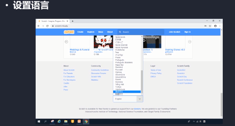

> Scratch的环境搭建

- 在线方式（http://scratch.mit.edu）
- 离线方式（下载安装Scratch 3.0桌面版）

##### 在线方式

- 如果没有账户，首先需要创建一个自己的账户

  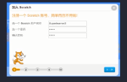

  注册的时候，用户名要是别人没有使用的密码，输入监护人的邮箱！最好是有家长注册比较好。

  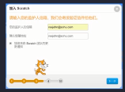

  邮箱输入自己的邮箱而不是老师的！

离线方式（下载安装Scratch3.0桌面版)(支持win10 以上的版本)

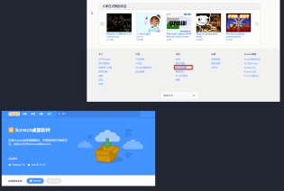

安装完之后，桌面将会出现双击就可以打开，如下图所示：

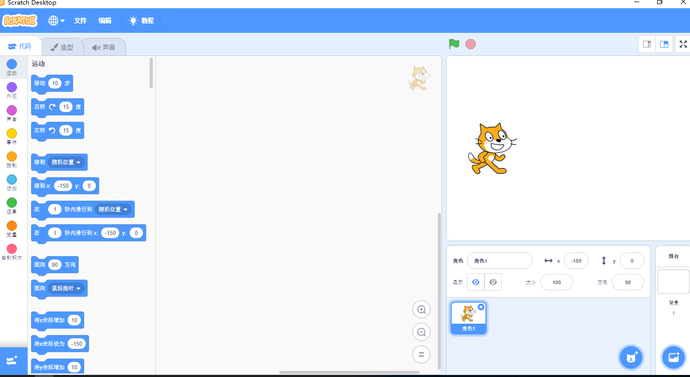

如果不显示中文的话，点击左上角的地球标志，拉到最下面，选择简体中文即可！

##### 项目编辑器

项目编辑器是编写Scratch程序的主要区域，在线版和离线版的项目编辑器几乎是一样的。

Scratch3.0的项目编辑器分为`5`个区域。

> - 菜单栏
> - 操控区（项目编辑区）
> - 代码区
> - 舞台区
> - 角色列表区

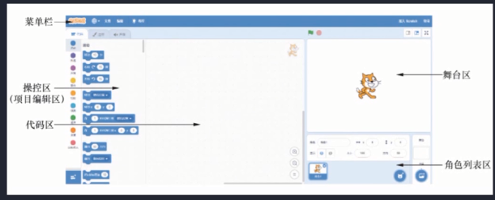

###### 舞台区

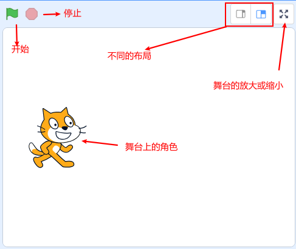

###### 角色区

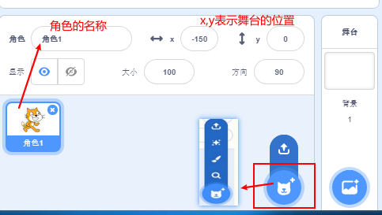

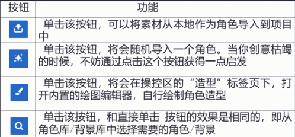

##### 操控区

- 代码

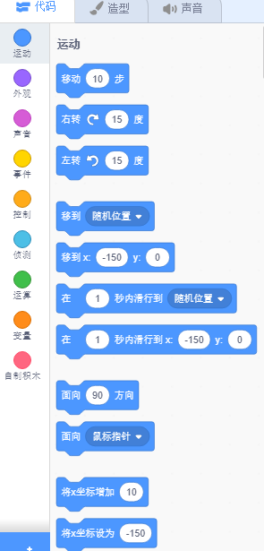

- 造型

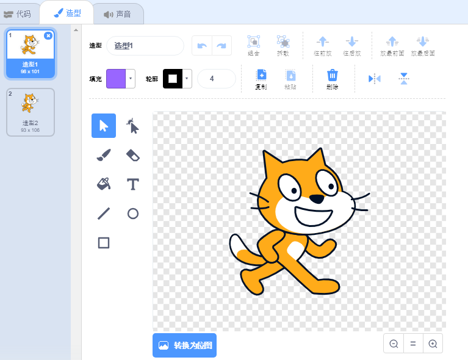

##### 声音

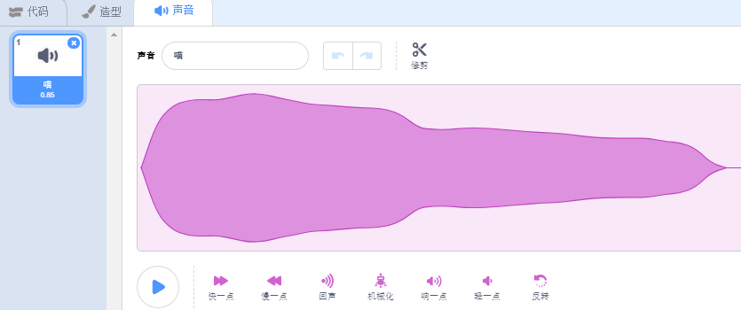

### 开始我们的第一个程序

- 删除小猫角色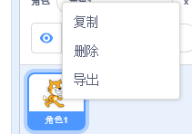

- 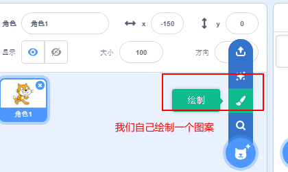

- 绘图

  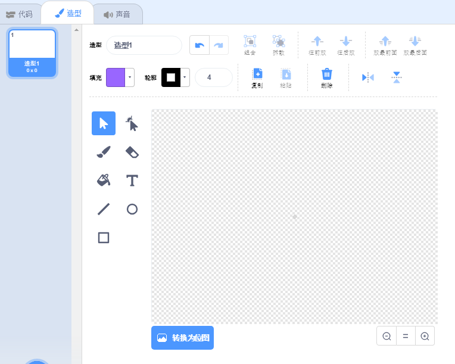

  默认为矢量图：放大了不会失真，图片还是很清楚！

  位图，相当于手机数码相机拍摄的照片，放大了会失真！

  此时写了一个Hello英语

  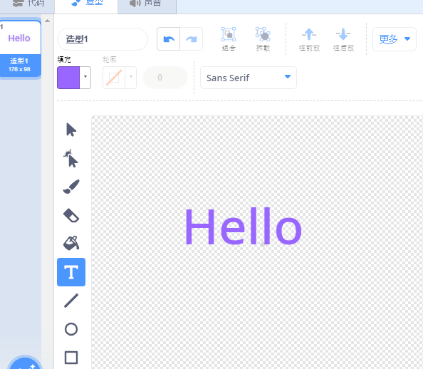

  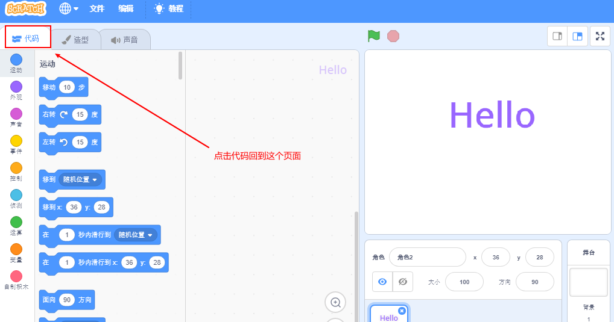

  制作如下的效果：

  - 当角色点击的时候，使该颜色发生变化后发出声音

  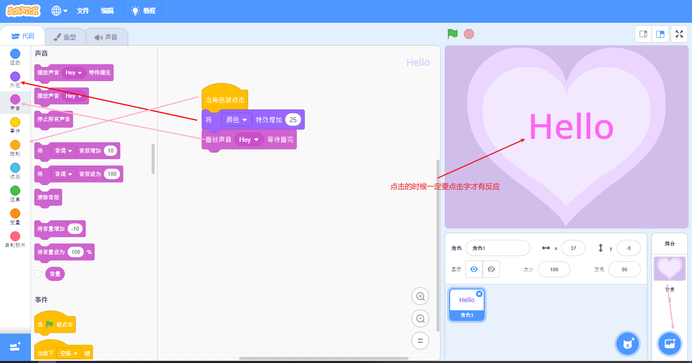

  当我点击Hello的时候就会发出响声！