## navicat15

1、下载安装源文件

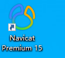

2、下载破解软件

下载地址：https://pan.baidu.com/share/init?surl=g-sJnJDPkix57z9UuThzsg 密码：zppg

a、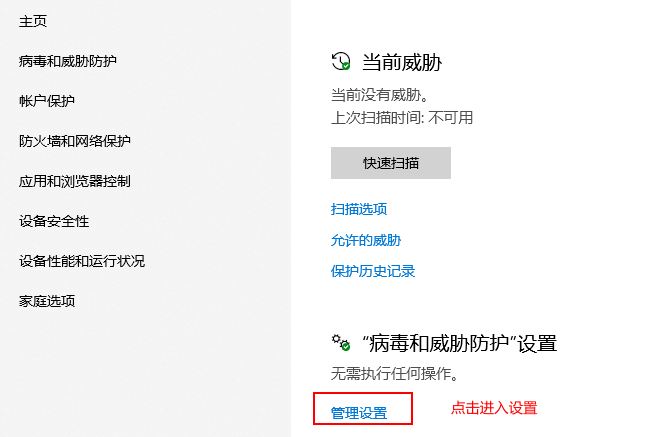

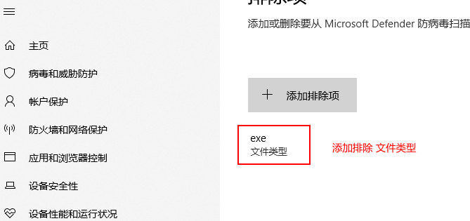

b、激活过程

使用注册机先退出所有杀毒软件，在打开注册机，否则会一直报错。

双击打开：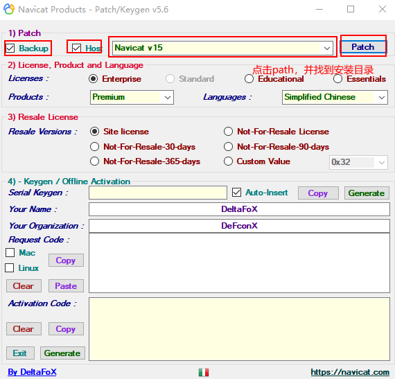

出现以下内容

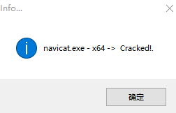

3、在License里选中Enterprise在Produce里选择Premiuum、在Languages里选择SimplifieldChinese

其他保持默认即可；

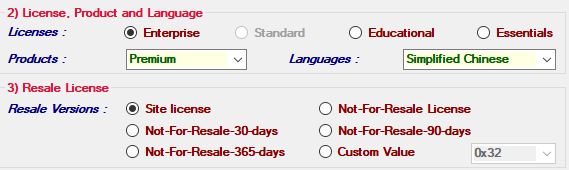

4、keygen

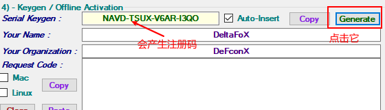

> 重点
>
> 点击注册前一定要断网
>
> 点击注册前一定要断网
>
> 点击注册前一定要断网

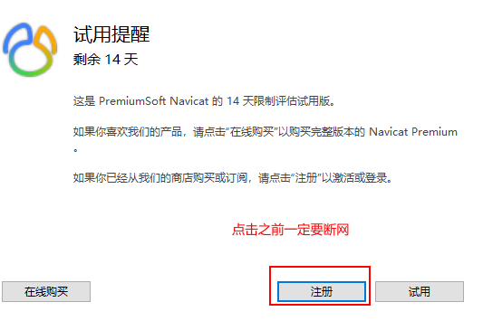

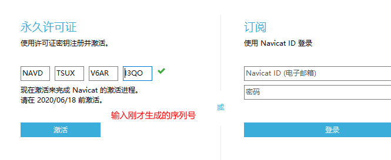

点击激活了，因为断网会产生这样的结果

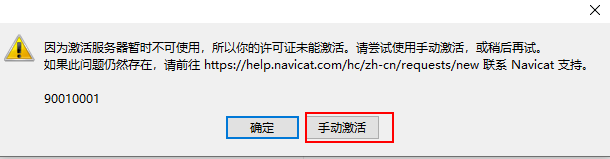

点击手动激活！

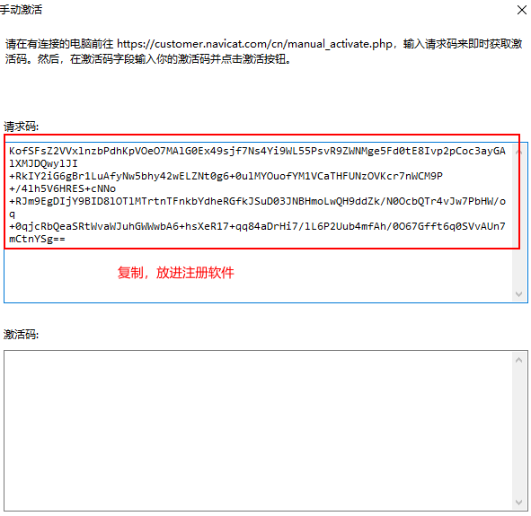

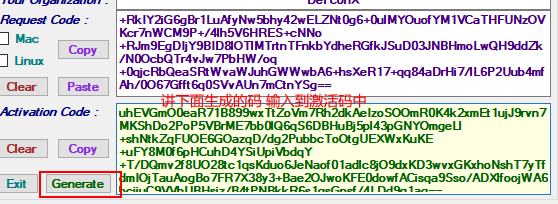

点击激活

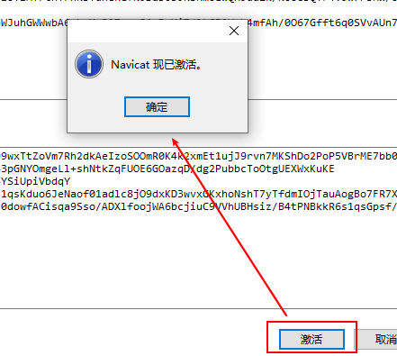

> 激活成功

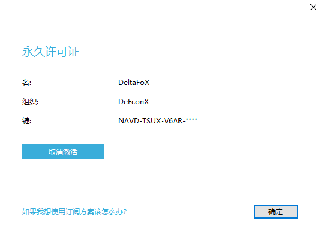

