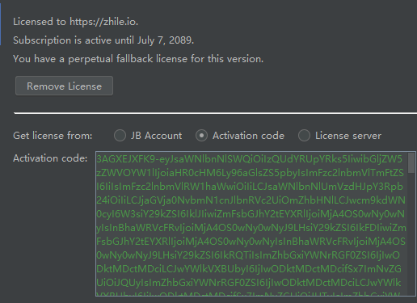

# pycharm破解流程

> 感谢zhile.io博主

关注本网站的公众号 获取`jetbrains-agent`的最新链接。直接将下载下来的文件拖到pycharm中。

这里我分享的2020.1.1版本的agent，地址：

```
链接：https://pan.baidu.com/s/12BWaG4I6sMP9PfiOmCOu3A 提取码：3rhg 
复制这段内容后打开百度网盘手机App，操作更方便哦
```

当然pycharn软件是全新安装的（为了避免错误）

安装完后，可以自定义[Activation code](https://zhile.io/jetbrains-paid-plugins-license.html)，前提是超过一年的github账号。

地址为：https://zhile.io/custom/license

输入激活码即可。



参考文档：https://www.jianshu.com/p/4cbc0e82d557