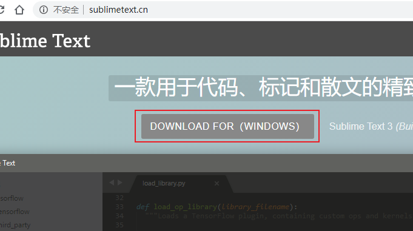
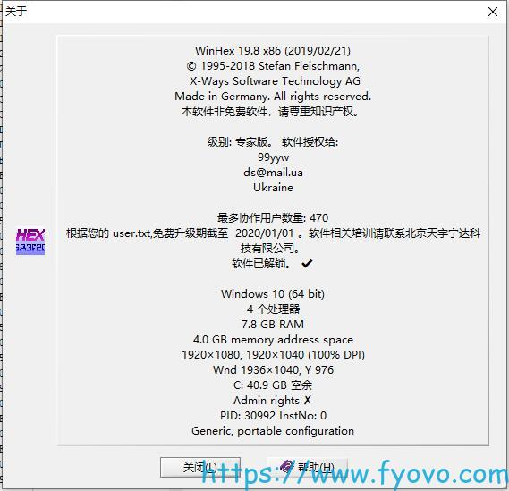
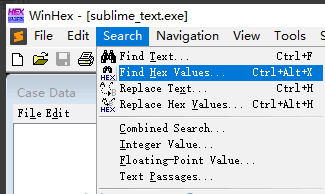
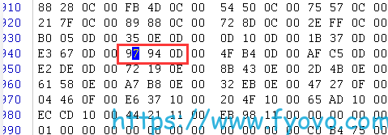
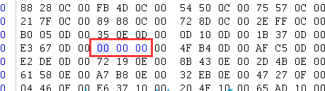
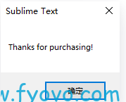

# sublime 版本3破解教程

> 参考网址：https://www.fyovo.com/6206.html

1、下载sublime进行安装，网址：http://www.sublimetext.cn/ 国外的访问不了：http://www.sublimetext.com/ 安装过程这里就不写了！



2、破解

第一步：修改hosts

hosts地址:C:\Windows\System32\drivers\etc 输入这些

```auto
  #sublimetext　
  127.0.0.1 www.sublimetext.com
  127.0.0.1 sublimetext.com
  127.0.0.1 sublimehq.com
  127.0.0.1 telemetry.sublimehq.com
  127.0.0.1 license.sublimehq.com
  127.0.0.1 45.55.255.55
  127.0.0.1 45.55.41.223
```

第二步：修改编辑sublime_text.exe
 1、我是用的winhex，可自行选择其他可二进制修改文件的软件
**步骤：**
1、首先关闭sublime text3，打开安装目录，找到sublime_text.exe，复制粘贴备份一下。
是有winhex打开sublime_text.exe文件
2、winhex下载及注册激活：
	下载地址:链接：https://pan.baidu.com/s/1cGnW_J5XRUlBXlCeir230w 提取码：ig0z 
	注册信息:

```
      Name: 99yyw
      Addr: ds@mail.ua
      Addr: Ukraine
      Data: 777ECCCE7F77FE6BF840DFA6CF2441DB
      Data: 6340FB62056E7A0CDF7AE8D1797666F4
```
激活成功截图：



​	搜索十六进制，输入97940D
​	点解菜单栏最后一项setup可以设置中文，这里截图为英文
​	点击十六进制搜索：



在弹窗内输入97940D，然后会搜索到如下结果：



替换为 00 00 00



将完成后的文件保存覆盖原来的sublime_text.exe

**第三步：输入注册码注册**

打开Sublime text，然后点击菜单Help->Enter Lisence(帮助->输入注册码)：

输入如下信息：
```
  ----- BEGIN LICENSE (这行无需复制) -----
  TwitterInc
  200 User License
  EA7E-890007
  1D77F72E 390CDD93 4DCBA022 FAF60790
  61AA12C0 A37081C5 D0316412 4584D136
  94D7F7D4 95BC8C1C 527DA828 560BB037
  D1EDDD8C AE7B379F 50C9D69D B35179EF
  2FE898C4 8E4277A8 555CE714 E1FB0E43
  D5D52613 C3D12E98 BC49967F 7652EED2
  9D2D2E61 67610860 6D338B72 5CF95C69
  E36B85CC 84991F19 7575D828 470A92AB
```

最后显示Thanks for Purchase就成功啦··



