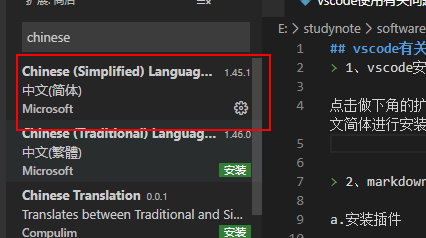
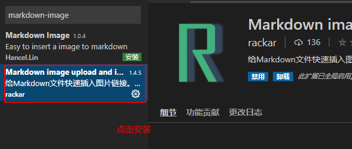
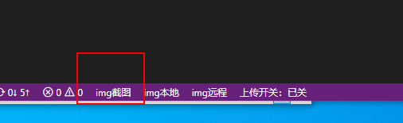
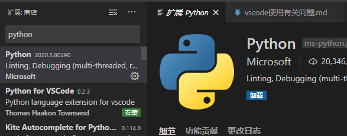
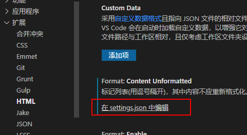
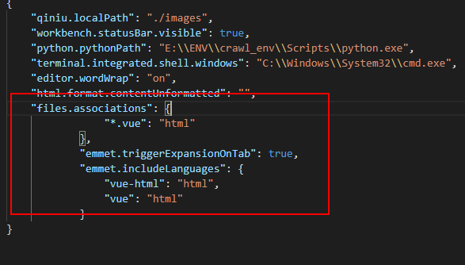

## vscode有关的使用教程
> 1、vscode安装中文插件

点击做下角的扩展，输入chinese找到中文简体进行安装即可。



安装完成之后就会显示中文的vscode界面了。
> 2、markdown插入图片

a.安装插件

在Vscode扩展商店中安装如下两个插件

1、markdownlint 语法提示

2、Markdown Preview Enhanced预览显示

`好像上面的而两个功能vscode已经自带了。`

在扩展中搜markdown-image找到并安装此插件。或者使用快捷方式`ctrl+p`键入ext install markdown-image



安装完成之后，当剪切图片的时候，点击左下角的`img截图`就可以粘贴在这个文件中。



> 3、vscode配置python环境




> 4、VScode ---- vue中HTML代码tab键自动补全插件及配置

1、首先在vscode商店中下载并重新加载HTML Snippets

2、在设置setting.json中搜索files.asscociations配置对象



在最后边插入如下代码：

```vue
 "files.associations": {
        "*.vue": "html"
    },
    "emmet.triggerExpansionOnTab": true,
    "emmet.includeLanguages": {
        "vue-html": "html",
        "vue": "html"
    }
```



在html结构中就可以使用tab键自动补全标签