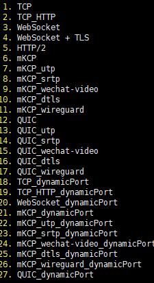

## 谷歌云
```
entos7系统配置和Debian系统配置 [视频中我讲错了acme.sh脚本所有证书将每60天自动更新一次，大家无需执行第9部操作（如果你非要手动更新随意）]

第一步 V2RAY官方脚本搭建
更新服务器 yum -y update(部分系统提示NO packages marked for update则无需更新)
#设置硬件时钟调整为与本地时钟一致
timedatectl set-local-rtc 1
#设置时区为上海
timedatectl set-timezone Asia/Shanghai


Debian系统同步时间如下：
date -R 查看时间
rm -rf /etc/localtime
cp /usr/share/zoneinfo/Asia/Shanghai /etc/localtime

第二部 2 .搭建bbr 可以放在后边安装
yum -y install wget
wget "https://github.com/chiakge/Linux-NetSpeed/raw/master/tcp.sh" && chmod +x tcp.sh && ./tcp.sh 


第三步
1. 安装v2ray官方代码bash <(curl -L -s https://install.direct/go.sh)
vim /etc/v2ray/config.json: 配置文件
ervice v2ray start|stop|status|reload|restart|force-reload 控制 V2Ray 的运行

第四步
https://my.freenom.com/免费注册地址 当然我们也可以自行购买付费域名
证书生成工具 (温馨提示您还可以启用自动升级acme.sh在root下输入 acme.sh upgrade)
1.以下提供3种方法选其中任意一种方法安装证书工具
  （1）curl  https://get.acme.sh | sh  
  （2）wget -O -  https://get.acme.sh | sh（先安装wget）yum -y install wget
  （3）git clone https://github.com/acmesh-official/acme.sh.git
      cd ./acme.sh
      ./acme.sh --install

2.（1）谷歌云请安装（如果其他品牌vps也提示 install socat firt也请安装socat）centos7系统执行 yum install socat （2）debian系统执行 apt-get install openssl cron socat curl 

3.source ~/.bashrc 

4.如果依然报错请查看报错面板提示信息，尝试安装acme.sh相关依赖项，比如安装 yum install netcat（centos安装）或sudo apt-get -y install netcat （debian安装）acme.sh 的依赖项主要是 netcat（如果提示报错才安装，不提示报错忽略）
  acme.sh 会安装到 ~/.acme.sh 目录下 （可通过root命令下 输入cd ~/.acme.sh查看，不懂的朋友请忽略继续下一步）

5.acme.sh 生成证书
1. 以下的命令会临时监听 80 端口，请确保执行该命令前 80 端口没有使用 (80是http端口)
  （1）centos7系统 执行sudo ~/.acme.sh/acme.sh --issue -d 域名 --standalone -k ec-256 
  （2）Debian系统  执行bash ~/.acme.sh/acme.sh --issue -d 域名 --standalone -k ec-256 
  （3）如果您80在反向代理或负载均衡器后面使用非标准端口，则可以--httpport用来指定端口
       Debian系统  执行bash ~/.acme.sh/acme.sh --issue -d 域名 --standalone --httpport 端口 -k ec-256
  （4）如果您80在反向代理或负载均衡器后面使用非标准端口，则可以--httpport用来指定端口
       centos7系统 执行sudo ~/.acme.sh/acme.sh --issue -d 域名 --standalone --httpport 端口 -k ec-256
       
2. 以下的命令会临时监听 443 端口，请确保执行该命令前 443 端口没有使用 （443是https端口）
  （1）centos7系统 执行sudo ~/.acme.sh/acme.sh --issue -d 域名 --alpn -k ec-256
  
  （2）如果您443在反向代理或负载均衡器后面使用非标准端口，则可以--tlsport用来指定端口
       centos7系统  执行sudo ~/.acme.sh/acme.sh --issue -d 域名 --alpn --tlsport 端口 -k ec-256 
  
  （3）Debian系统   执行bash ~/.acme.sh/acme.sh --issue -d 域名 --alpn -k ec-256 
  
  （4）如果您443在反向代理或负载均衡器后面使用非标准端口，则可以--tlsport用来指定端口
       Debian系统  执行bash ~/.acme.sh/acme.sh --issue -d 域名 --alpn --tlsport 端口 -k ec-256 
    
  
      -k 表示密钥长度，后面的值可以是 ec-256 、ec-384、2048、3072、4096、8192，带有 ec 表示生成的是 ECC 证书，没有则是 RSA 证书。在安全性上 256 位的 ECC 证书等同于 3072 位的 RSA 证书


6.安装证书和密钥安装到 /etc/v2ray
1. ecc 安装代码 sudo ~/.acme.sh/acme.sh --installcert -d 域名 --fullchainpath /etc/v2ray/v2ray.crt --keypath /etc/v2ray/v2ray.key --ecc   
2. rsa 安装代码 sudo ~/.acme.sh/acme.sh --installcert -d 域名 --fullchainpath /etc/v2ray/v2ray.crt --keypath /etc/v2ray/v2ray.key --rsa

7.配置文件vim /etc/v2ray/config.json
{
  "inbounds": [
    {
      "port": 443, // 服务器端口
      "protocol": "vmess",    
      "settings": {
        "clients": [
          {
            "id": "23ad6b10-8d1a-40f7-8ad0-e3e35cd38297",  
            "alterId": 64
          }
        ]
      },
      "streamSettings": {
        "network": "tcp",
        "security": "tls", // security 要设置为 tls 才会启用 TLS
        "tlsSettings": {
          "certificates": [
            {
              "certificateFile": "/etc/v2ray/v2ray.crt", // 证书文件
              "keyFile": "/etc/v2ray/v2ray.key" // 密钥文件
            }
          ]
        }
      }
    }
  ],
  "outbounds": [
    {
      "protocol": "freedom",
      "settings": {}
    }
  ]
}

 service v2ray start|stop|status|reload|restart|force-reload 控制 V2Ray 的运行
 
 
 8.验证是否正常开启 TLS https://www.ssllabs.com/ssltest/index.html
 
 9.手动更新证书密钥生成到 /etc/v2ray （温馨提示：视频中我讲错了acme.sh脚本所有证书将每60天自动更新一次，大家无需担心证书到期无法使用）
 ecc sudo ~/.acme.sh/acme.sh --renew -d 域名 --force --ecc
 rsa sudo ~/.acme.sh/acme.sh --renew -d 域名 --force --rsa
 
 
 温馨提示：V2Ray 的 TLS 不是伪装或混淆，这是真正的 TLS。因此才需要域名和证书。 WS(WebSocket) 也不是伪装
 注意：使用 Qualys SSL Labs's SSL Server Test 要求使用 443 端口，意味着你服务器配置的 inbound.port 应当是 443
```

## V2ray+ws+tls，一键安装教学

新建服务器，域名指向ip。

登录SSH

```shell
#一键安装脚本
bash <(curl -s -L https://git.io/v2ray.sh)
```


选择协议：此次选择的是4

按照上面的提示，顺序安装，这里用的是233的一键安装代码。

`安装完ssr响应速度会v2ray快很多`


# 官方脚本搭建V2Ray+Nginx+WS+TLS+Cloudflare

```shell
 官方脚本搭建V2Ray+Nginx+WS+TLS+Cloudflare
第一 准备工作
        1. 全新的服务器连接工具 本期视频必须的软件装备！！！重点提示
            下载解压即可用 功能强大 以后搭建服务器建议使用 可见即所得
             百度网盘：https://pan.baidu.com/s/1w1UQssmn6yCtwLDGhYqv_A
提取码：ylku
                MEGA：https://mega.nz/#!HXZynSjL!pcpKDRYZaCC_I4JDzF9ARWLfNE0NL87hcuC9YMr2u8M
             cloudflare：https://www.cloudflare.com/  CDN中转隐藏真实IP 获取永久免费域名证书！！！
             谷歌云
                    谷歌云获取root登陆 使用连接工具连接服务器配置方法
                                点击SSH
                                 sudo -i
                                 passwd root 按提示输入两次密码 密码不会显示 记住即可
                                 wget -qO- git.io/fpQWf | bash  若输入该指令出现提示 wget：command not fund 需安装wget 方法如下
                                        yum -y install wget     （ContOS Yum 安装 wget）
                                        apt-get install wget    （Debian Ubuntu 安装 wget）
                                 然后再次输入脚本wget -qO- git.io/fpQWf | bash
                                 安装完成后输入脚本 service sshd restart
        2. 上期内容的重复准备
            VPS服务器  启动磁盘centos7+/debian9+/ubuntu16+ 【教程演示使用的是debian9】
                 谷歌云(免费)
                        谷歌云注册：https://youtu.be/JNLGOCzK0jc
                         创建防火墙规则教程 https://youtu.be/iuaHpQb6tvE?t=65
                         创建虚拟机实例(VM实例)：https://youtu.be/MgiaHBuCc3A?t=87
                 购买其他VPS服务器
                        搬瓦工 https://bit.ly/2QI5IaZ
             申请域名：
                 免费域名  https://www.freenom.com/
                       视频教程： https://youtu.be/GNw8IC_G61k?t=212
                        域名解析：https://youtu.be/bgJ3t2_OZ2Y?t=84
                       免费域名永久免费权限获取方法 https://youtu.be/G48xVo-HIfw
                 低价位域名 https://www.namesilo.com/ (永久隐私保护)
                       视频教程：https://youtu.be/G48xVo-HIfw
                        域名解析：https://youtu.be/G48xVo-HIfw?t=402
              ping检测
                        https://tools.ipip.net/ping.php
                        http://ping.chinaz.com/
 第二 设置时间
             方法一 rm /etc/localtime
                  ln -sf /usr/share/zoneinfo/Asia/Shanghai /etc/localtime
              方法二  date -R  查询日期
                  cp /usr/share/zoneinfo/Asia/Shanghai /etc/localtime  修改日期
                  输入y确认 可以再次输入date -R确认一下时间与本机时间是否一致
 第三  安装常用软件包
          apt update && apt upgrade -y
          apt-get update && apt-get install unzip zip wget curl  mc  nano sudo ufw socat ntp ntpdate gcc git vim socat make build-essential -y
 第四  安装BBR
          wget -N –no-check-certificate https://raw.githubusercontent.com/ToyoDAdoubi/doubi/master/ssr.sh && chmod +x ssr.sh && bash ssr.sh
          选择14 其他功能 然后输入1 配置BBR 选择1 安装
          安装完成 bash ssr.sh查看是否启动 选择14— 1—- 4
         以上方法使用于所有内核版本，如果内核版本在4.9.0以上建议使用以下脚本安装BBR 查看内核版本 uname -a
wget –no-check-certificate https://github.com/teddysun/across/raw/master/bbr.sh && chmod +x bbr.sh && ./bbr.sh    在168期视频中已演示
 第五 Debian 9 安装 libsodium支持chacha20 (可选操作)
         查看CPU指令集是否支持AES加密：(chacha20/aes)
         more /proc/cpuinfo  在flags里面如果没有出现aes则说明不支持
        下载、编译和安装(分别执行以下5个命令)
         apt-get install build-essential make
         wget https://download.libsodium.org/libsodium/releases/LATEST.tar.gz
         tar xf LATEST.tar.gz && cd libsodium-stable
         ./configure && make -j4 && make install
         ldconfig
       删除编译安装留下的源代码（可以不做）
       cd ..  (回到上一级目录)
       rm LATEST.tar.gz
       rm -r libsodium-stable
       此时已经不在root文件夹 运行 cd .. 回到root  或者运行cd /root
 第六  安装 nginx  搭建伪站点
          Nginx (engine x) 是一个高性能的HTTP和反向代理web服务器，同时也提供了IMAP/POP3/SMTP服务。Nginx是由伊戈尔·赛索耶夫为俄罗斯访问量第二的Rambler.ru站点（俄文：Рамблер）开发的，第一个公开版本0.1.0发布于2004年10月4日。其将源代码以类BSD许可证的形式发布，因它的稳定性、丰富的功能集、示例配置文件和低系统资源的消耗而闻名。2011年6月1日，nginx 1.0.4发布。
Nginx是一款轻量级的Web 服务器/反向代理服务器及电子邮件（IMAP/POP3）代理服务器，在BSD-like 协议下发行。其特点是占有内存少，并发能力强，事实上nginx的并发能力在同类型的网页服务器中表现较好，中国大陆使用nginx网站用户有：百度、京东、新浪、网易、腾讯、淘宝等。
         apt install nginx  安装nginx
         安装完nginx以后默认是自动运行 查看nginx运行是否正常  systemctl status nginx
         停止nginx (暂停)
              systemctl stop nginx或service nginx stop
         安装伪站点
         rm -rf /home/wwwroot && mkdir -p /home/wwwroot && cd /home/wwwroot
         git clone https://github.com/dunizb/sCalc.git
         回到root目录  cd /root
 第七 安装官方v2ray
        bash <(curl -Ls https://install.direct/go.sh)
        安装完成 输入 systemctl status v2ray 查看v2ray运行状态
              显示active(running) 正在运行
              显示inactive(dead)   关闭状态
        如果正在运行 先暂停 sysremctl stop v2ray    上箭头可以查看以前的命令
 第八 获取和安装证书
          curl https://get.acme.sh | sh
          source ~/.bashrc 这一行不用输入运行
          导入CF的API：
          export CF_Key=”4a39058f799fc57ffc88b8bf924c73570da5e”    替换key
           查找key方法：登录cloudflare  点击用户名 — API Tokens—Global API Key —  view  根据提示输入cloudflare用户名和密码
          export CF_Email=”alsay365@gmail.com”  替换成注册cloudflare的邮箱
       安装 替换域名！！！
        ~/.acme.sh/acme.sh –issue –dns dns_cf -d sngsw.ml -d *.sngsw.ml -k ec-256
        申请通配符 为根域名及根域名以下的所有二级域名申请证书
       ~/.acme.sh/acme.sh –installcert -d sngsw.ml -d *.sngsw.ml –fullchainpath /etc/v2ray/sngsw.ml.crt –keypath /etc/v2ray/sngsw.ml.key –ecc
        定期自动更新证书
         acme.sh –upgrade –auto-upgrade
          自动更新若失败 可手动修改 root—acme.sh—account.conf(双击)—AUTO-UPGRADE=”0″ 0是关闭自动更新 改成1 自动更新
 第九  修改配置文件信息
         v2ray  nginx   vi /etc/v2ray/config.json   vi /etc/nginx/conf.d/default.conf  根据生成的文件而定路径
        修改完成回到root重启  cd /root
                                             sysremctl restart nginx
                                             查看有无错误 systemctl status nginx
                                              sysremctl restart v2ray
                                              systemctl status v2ray
 最后要设置开机启动
        systemctl enable v2ray   v2ray开机启动
        systemctl enable nginx   nginx开机启动
        systemctl start v2ray     启动v2ray
        systemctl start nginx      启动nginx
 重启终端 reboot
****************************************************************************************
第十 设置延时开机启动(不建议 请忽略)
        先取消v2ray开机自启
         systemctl disable v2ray
        添加延时启动脚本 vim /etc/v2ray/v2ray-delayboot.sh
        进入编辑模式 点击 i 输入以下内容
        sleep 20
        service v2ray restart
        Esc— :wq  保存退出
        为延时启动脚本设置开机自启 vim /etc/rc.local
         进入编辑模式 i  输入以下内容 如果里面有文字 就在文字的下面加入
#!/bin/sh -e
#
# rc.local
#
# This script is executed at the end of each multiuser runlevel.
# Make sure that the script will “exit 0” on success or any other
# value on error.
#
# In order to enable or disable this script just change the execution
# bits.
#
# By default this script does nothing.
nohup /etc/v2ray/v2ray-delayboot.sh &
exit 0
         Esc— :wq  保存退出
         赋予rc.local权限 chmod +x /etc/rc.local
十一  处理nginx启动错误Failed to read PID from file /run/nginx.pid (可选 不影响使用)
让 systemd 在执行 ExecStart 的指令后等待一点点时间即可
如果你的 nginx 启动需要时间更长，可以把 sleep 时间改长一点
方法一
建立目录
mkdir -p /etc/systemd/system/nginx.service.d && cd /etc/systemd/system/nginx.service.d
在新建目录中建立文件override.conf：
vim overrid.conf
编辑模式 i 输入以下内容:
[Service]
ExecStartPost=/bin/sleep 0.5
保存退出 Esc— :wq
然后执行
systemctl daemon-reload
systemctl restart nginx.service
方法二
如果nginx出现提示错误 nginx.service: Failed to read PID from file /run/nginx.pid: Invalid argument
运行下面4个命令
mkdir /etc/systemd/system/nginx.service.d
printf “[Service]\nExecStartPost=/bin/sleep 0.1\n” > /etc/systemd/system/nginx.service.d/override.conf
systemctl daemon-reload
systemctl restart nginx
十二  TLS开启OSCP(可选)
          openssl s_client -connect aws007.ml:443 -status -tlsextdebug < /dev/null 2>&1 | grep -i “OCSP response”
           开启TCP fastopen
           echo 3 > /proc/sys/net/ipv4/tcp_fastopen
附加内容
生成 ssl/tls 证书并配置
注册一个 cloudflare 账号，添加自己已注册的域名，注意将域名 A 记录的 Proxy status 设置为橙色云朵状态，这样才会走 cloudflare 的 CDN，如果设置为灰色云朵状态，表示不走 cloudflare 的 CDN，而是域名直连你自己的服务器，然后在你的域名注册服务商那里将域名的 dns 服务器修改为 cloudflare 提供的 dns。
cloudflare 的 SSL/TLS 说明：Full 表示客户端到CDN，CDN到服务器的数据传输都加密
                                               默认为 Flexible，Flexible 表示客户端到CDN 加密，CDN到服务器不加密
                                               如果服务器已经开启tls，设置为 Full。
 安装v2ray客户端
             PC端v2rayN安装方法：https://youtu.be/WxQx4YGZenI 不管以前如何安装客户端 视频中的方法特别推荐
              安卓端：https://youtu.be/fiEBr0DZuw0
                ios端：https://youtu.be/ceLX2Kq4pkc
             windows Mac Andriod端：https://youtu.be/t6YWuhIf1rQ
                                     windows端：https://youtu.be/VV4e3elotzk
 配置 Telegram MTProto
          输入 v2ray tg 即可配置 TG 专用代理
         视频教程    https://www.youtube.com/watch?v=ouut9bgPkc8
 v2ray相关命令
                安装完成后，输入 v2ray 即可管理 V2Ray
                 v2ray info       查看 V2Ray 配置信息
                 v2ray config   修改 V2Ray 配置
                 v2ray link       生成 V2Ray 配置文件链接
                 v2ray infolink 生成 V2Ray 配置信息链接
                 v2ray qr          生成 V2Ray 配置二维码链接
                 v2ray ss          修改 Shadowsocks 配置
                 v2ray ssinfo    查看 Shadowsocks 配置信息
                 v2ray ssqr       生成 Shadowsocks 配置二维码链接
                 v2ray status    查看 V2Ray 运行状态
                 v2ray start       启动 V2Ray
                 v2ray stop       停止 V2Ray
                 v2ray restart   重启 V2Ray
                 v2ray log         查看 V2Ray 运行日志
                 v2ray update   更新 V2Ray
                 v2ray update.sh 更新 V2Ray 管理脚本
                 v2ray uninstall 卸载 V2Ray
```

