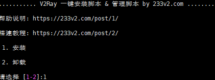

## 谷歌云
```
entos7系统配置和Debian系统配置 [视频中我讲错了acme.sh脚本所有证书将每60天自动更新一次，大家无需执行第9部操作（如果你非要手动更新随意）]

第一步 V2RAY官方脚本搭建
更新服务器 yum -y update(部分系统提示NO packages marked for update则无需更新)
#设置硬件时钟调整为与本地时钟一致
timedatectl set-local-rtc 1
#设置时区为上海
timedatectl set-timezone Asia/Shanghai


Debian系统同步时间如下：
date -R 查看时间
rm -rf /etc/localtime
cp /usr/share/zoneinfo/Asia/Shanghai /etc/localtime

第二部 2 .搭建bbr 可以放在后边安装
yum -y install wget
wget "https://github.com/chiakge/Linux-NetSpeed/raw/master/tcp.sh" && chmod +x tcp.sh && ./tcp.sh 


第三步
1. 安装v2ray官方代码bash <(curl -L -s https://install.direct/go.sh)
vim /etc/v2ray/config.json: 配置文件
ervice v2ray start|stop|status|reload|restart|force-reload 控制 V2Ray 的运行

第四步
https://my.freenom.com/免费注册地址 当然我们也可以自行购买付费域名
证书生成工具 (温馨提示您还可以启用自动升级acme.sh在root下输入 acme.sh upgrade)
1.以下提供3种方法选其中任意一种方法安装证书工具
  （1）curl  https://get.acme.sh | sh  
  （2）wget -O -  https://get.acme.sh | sh（先安装wget）yum -y install wget
  （3）git clone https://github.com/acmesh-official/acme.sh.git
      cd ./acme.sh
      ./acme.sh --install

2.（1）谷歌云请安装（如果其他品牌vps也提示 install socat firt也请安装socat）centos7系统执行 yum install socat （2）debian系统执行 apt-get install openssl cron socat curl 

3.source ~/.bashrc 

4.如果依然报错请查看报错面板提示信息，尝试安装acme.sh相关依赖项，比如安装 yum install netcat（centos安装）或sudo apt-get -y install netcat （debian安装）acme.sh 的依赖项主要是 netcat（如果提示报错才安装，不提示报错忽略）
  acme.sh 会安装到 ~/.acme.sh 目录下 （可通过root命令下 输入cd ~/.acme.sh查看，不懂的朋友请忽略继续下一步）

5.acme.sh 生成证书
1. 以下的命令会临时监听 80 端口，请确保执行该命令前 80 端口没有使用 (80是http端口)
  （1）centos7系统 执行sudo ~/.acme.sh/acme.sh --issue -d 域名 --standalone -k ec-256 
  （2）Debian系统  执行bash ~/.acme.sh/acme.sh --issue -d 域名 --standalone -k ec-256 
  （3）如果您80在反向代理或负载均衡器后面使用非标准端口，则可以--httpport用来指定端口
       Debian系统  执行bash ~/.acme.sh/acme.sh --issue -d 域名 --standalone --httpport 端口 -k ec-256
  （4）如果您80在反向代理或负载均衡器后面使用非标准端口，则可以--httpport用来指定端口
       centos7系统 执行sudo ~/.acme.sh/acme.sh --issue -d 域名 --standalone --httpport 端口 -k ec-256
       
2. 以下的命令会临时监听 443 端口，请确保执行该命令前 443 端口没有使用 （443是https端口）
  （1）centos7系统 执行sudo ~/.acme.sh/acme.sh --issue -d 域名 --alpn -k ec-256
  
  （2）如果您443在反向代理或负载均衡器后面使用非标准端口，则可以--tlsport用来指定端口
       centos7系统  执行sudo ~/.acme.sh/acme.sh --issue -d 域名 --alpn --tlsport 端口 -k ec-256 
  
  （3）Debian系统   执行bash ~/.acme.sh/acme.sh --issue -d 域名 --alpn -k ec-256 
  
  （4）如果您443在反向代理或负载均衡器后面使用非标准端口，则可以--tlsport用来指定端口
       Debian系统  执行bash ~/.acme.sh/acme.sh --issue -d 域名 --alpn --tlsport 端口 -k ec-256 
    
  
      -k 表示密钥长度，后面的值可以是 ec-256 、ec-384、2048、3072、4096、8192，带有 ec 表示生成的是 ECC 证书，没有则是 RSA 证书。在安全性上 256 位的 ECC 证书等同于 3072 位的 RSA 证书


6.安装证书和密钥安装到 /etc/v2ray
1. ecc 安装代码 sudo ~/.acme.sh/acme.sh --installcert -d 域名 --fullchainpath /etc/v2ray/v2ray.crt --keypath /etc/v2ray/v2ray.key --ecc   
2. rsa 安装代码 sudo ~/.acme.sh/acme.sh --installcert -d 域名 --fullchainpath /etc/v2ray/v2ray.crt --keypath /etc/v2ray/v2ray.key --rsa

7.配置文件vim /etc/v2ray/config.json
{
  "inbounds": [
    {
      "port": 443, // 服务器端口
      "protocol": "vmess",    
      "settings": {
        "clients": [
          {
            "id": "23ad6b10-8d1a-40f7-8ad0-e3e35cd38297",  
            "alterId": 64
          }
        ]
      },
      "streamSettings": {
        "network": "tcp",
        "security": "tls", // security 要设置为 tls 才会启用 TLS
        "tlsSettings": {
          "certificates": [
            {
              "certificateFile": "/etc/v2ray/v2ray.crt", // 证书文件
              "keyFile": "/etc/v2ray/v2ray.key" // 密钥文件
            }
          ]
        }
      }
    }
  ],
  "outbounds": [
    {
      "protocol": "freedom",
      "settings": {}
    }
  ]
}

 service v2ray start|stop|status|reload|restart|force-reload 控制 V2Ray 的运行
 
 
 8.验证是否正常开启 TLS https://www.ssllabs.com/ssltest/index.html
 
 9.手动更新证书密钥生成到 /etc/v2ray （温馨提示：视频中我讲错了acme.sh脚本所有证书将每60天自动更新一次，大家无需担心证书到期无法使用）
 ecc sudo ~/.acme.sh/acme.sh --renew -d 域名 --force --ecc
 rsa sudo ~/.acme.sh/acme.sh --renew -d 域名 --force --rsa
 
 
 温馨提示：V2Ray 的 TLS 不是伪装或混淆，这是真正的 TLS。因此才需要域名和证书。 WS(WebSocket) 也不是伪装
 注意：使用 Qualys SSL Labs's SSL Server Test 要求使用 443 端口，意味着你服务器配置的 inbound.port 应当是 443
```

## V2ray+ws+tls，一键安装教学

新建服务器，域名指向ip。

登录SSH

```shell
#一键安装脚本
bash <(curl -s -L https://git.io/v2ray.sh)
```



选择协议：此次选择的是4

按照上面的提示，顺序安装，这里用的是233的一键安装代码。

`安装完ssr响应速度会v2ray快很多`