## video SRT windows

下载软件：https://github.com/wxbool/video-srt-windows

下载直接解压运行。

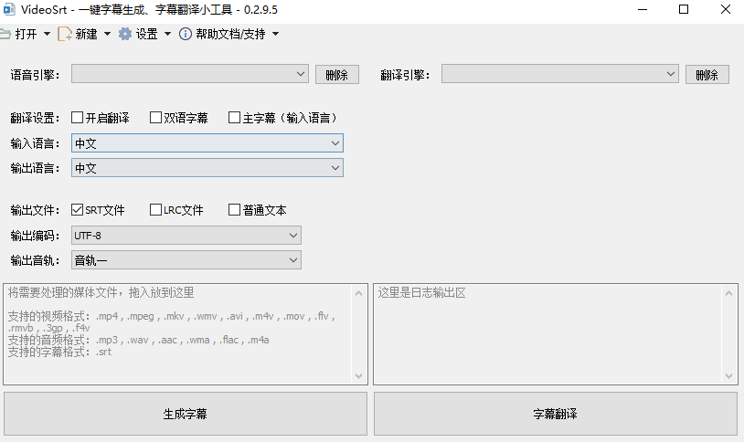

##### 制作阿里云OSS登录

https://account.aliyun.com/ 注册登录

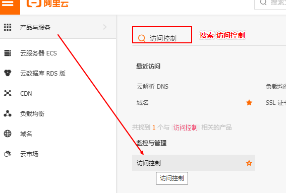

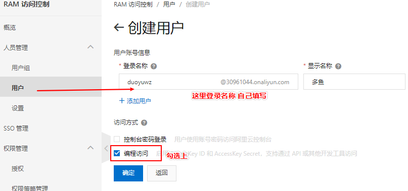

`编程访问一定要勾选上`确定后，将会收到验证码验证。

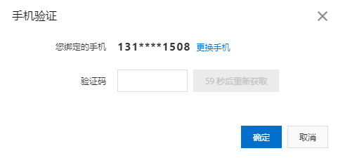

给用户添加权限

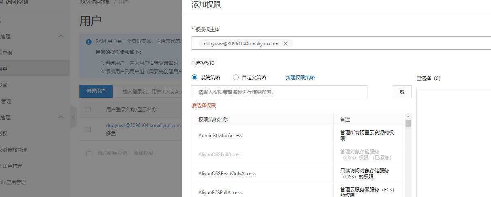

搜索 OSS 智能语音服务 两个

> 2、对象存储oss开通

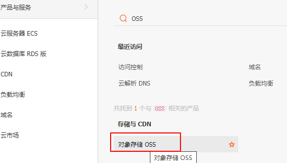

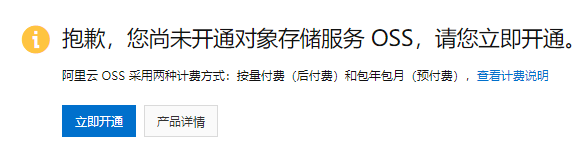

`立即开通`

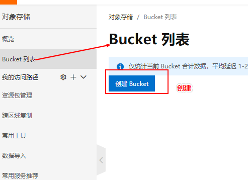

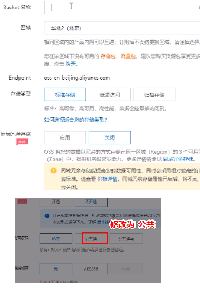

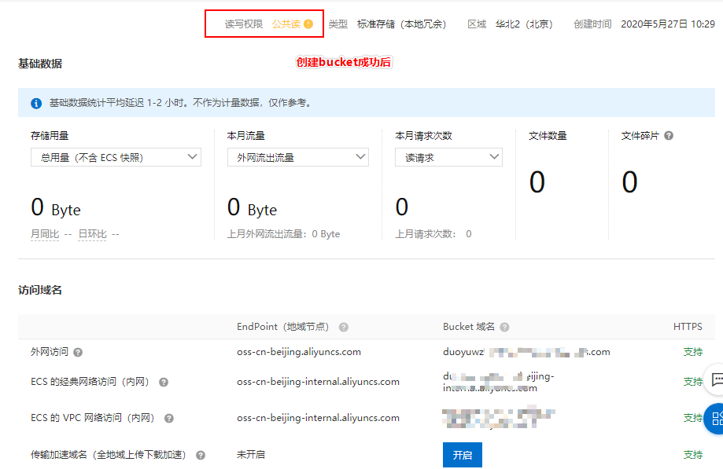

> 3、搜索 智能语音交互

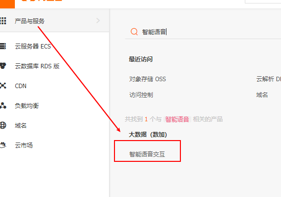

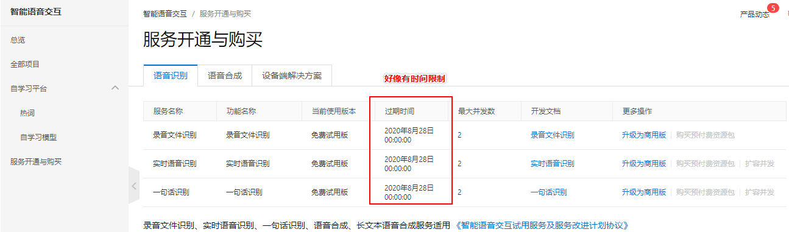

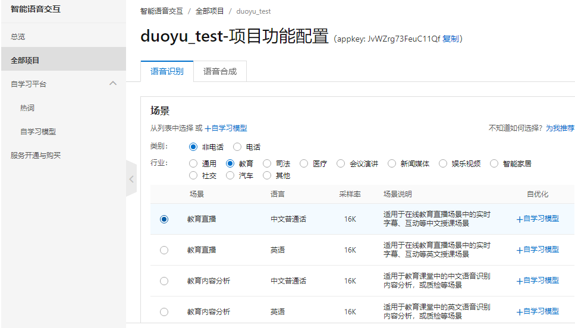

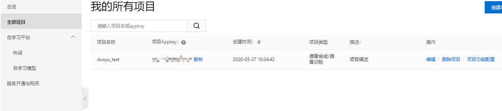

配置教程 后续补

### 百度云翻译服务 **(仅适用0.2.6及以下版本)**

> 1、注册百度账号

请先自行注册一个百度账号，视频教程中直接忽略，如有百度账号，可以直接进入下一步操作

> 2、开通百度翻译API服务

注册开发者->开通"通用翻译API"服务

`百度翻译：http://api.fanyi.baidu.com/product/112`管理控制 注册开发者

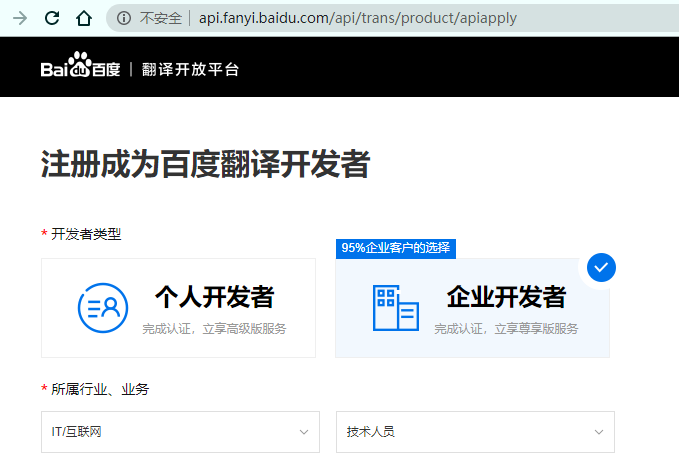

填写步骤：

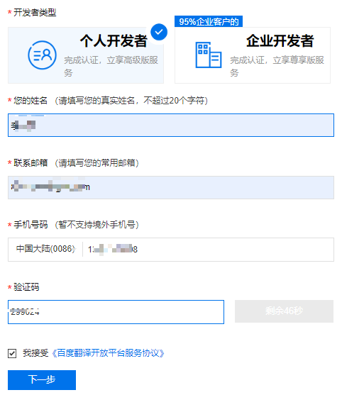

接下来进行认证：

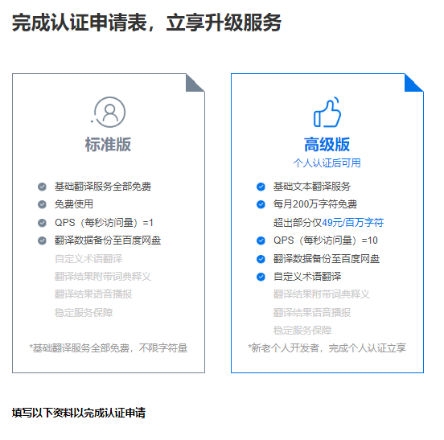

推荐认证个人高级版。

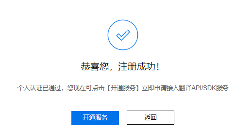

> 3、开通服务

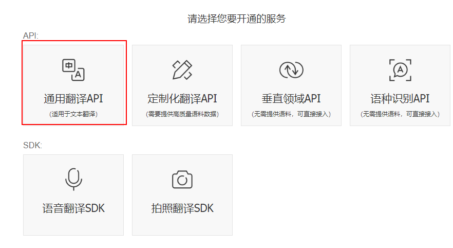

选择通用翻译API

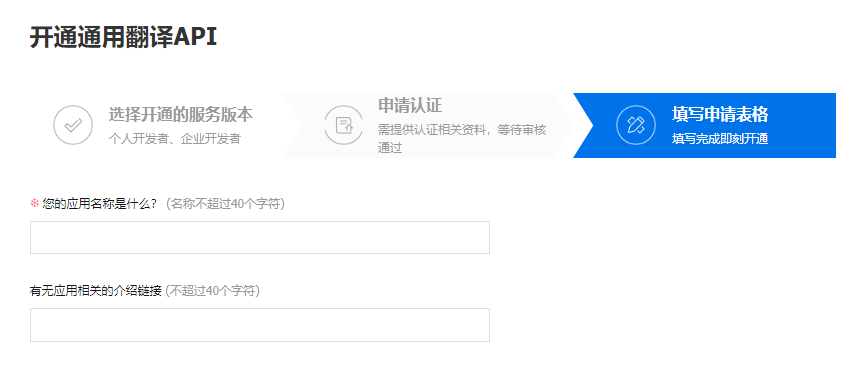

填写信息。

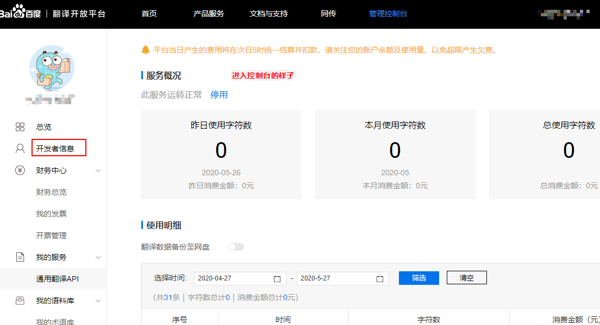

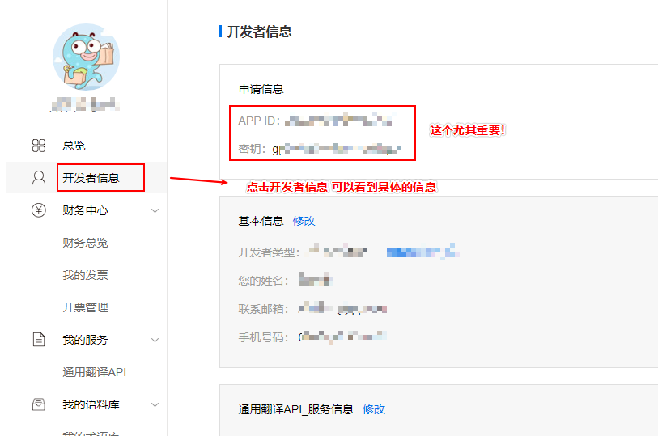

> 4、软件设置

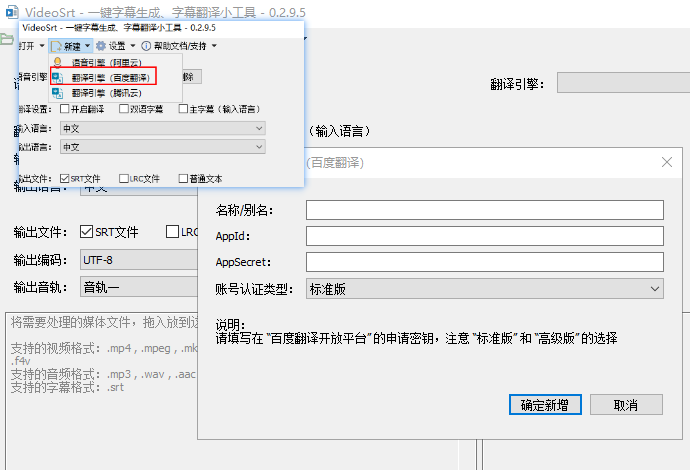

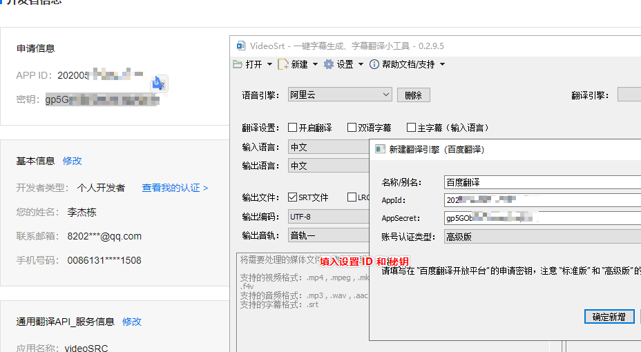

