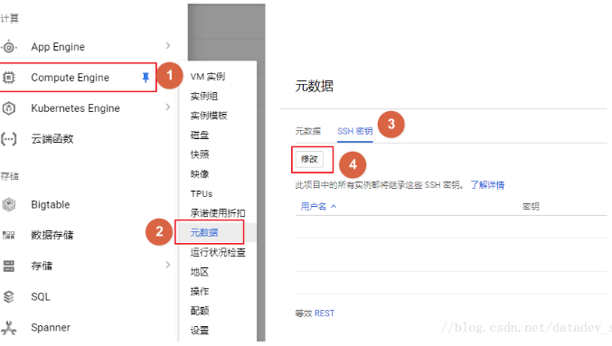

## 常见问题解决办法001

> 1、远程SSH密码忘了，怎么办？

目录：

一、以root用户登录

二、普通用户，秘钥登入

#### 1、用root用户登入

- 进入谷歌云实例面板


- 切花到root角色

  `sudo -i`

- 修改SSH配置文件 /etc/ssh/sshd_config

  修改`PermitRootLogin`和`PasswordAuthentication`为yes

  ```shell
  # Authentication:
  PermitRootLogin yes //默认为no，需要开启root用户访问改为yes
  
  # Change to no to disable tunnelled clear text passwords
  PasswordAuthentication yes //默认为no，改为yes开启密码登陆
  ```

- 给root用户设置密码

  `passwd root`

- 重启SSH服务使修改生效

  `/etc/init.d/ssh restart`

- 登录

  在xshell中，直接使用root账号密码登录

#### 2、新建普通用户登入

- 本地用户Xshell生成秘密钥


- 将秘钥配置到谷歌云上

  `菜单-计算殷勤-元数据-SSH秘钥-修改-添加一项`

  

  `粘贴刚才从Xshell复制的秘钥，在末尾添加[空格][用户名]这里就是google`,保存即可。

  

- 用xshell连接


`登录之后，输入命令 sudo -i切换到root用户`。注意添加的时候，用户验证修改为秘钥登录。