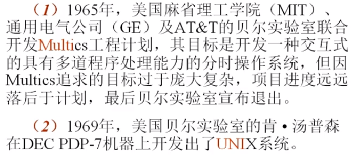
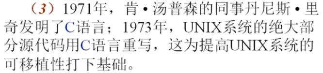

## 1.1 Unix发展史和发行版本

>  一、UNIX于Linux发展史

UNIX是父亲，linux是儿子。两者非常相似。

游戏导致技术的革新。TGP/IP协议。C语言的诞生解决了汇编语言移植性的问题。

<b>UNIX主要发行版本</b>

| 操作系统 | 公司 | 硬件平台 |
| -------- | :--- | -------- |
| AIX      | IBM  | PowerPC  |
|HP_UX|HP|PA_RISC|
|Solaris|Sun|SPARC|
|Linux|Red Hat、Ubuntu...|IA(Intel、AMD...)|
