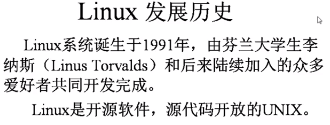
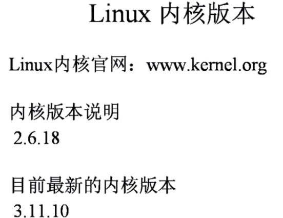
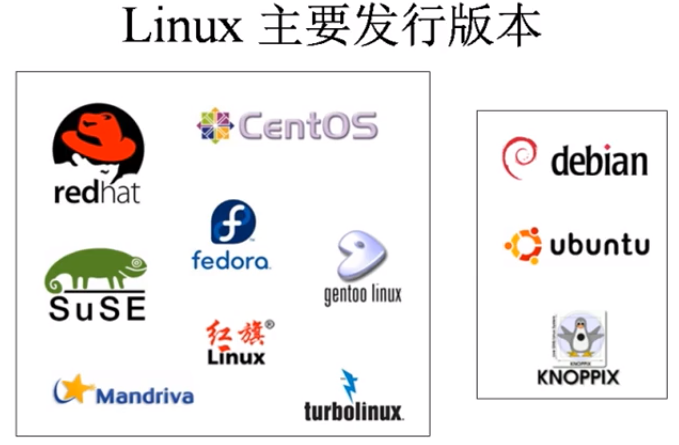

## 1.2 Linux发展历史和发行版本

企鹅Linux Logo

南极和北极不属于任何一个国家(意在认为Linux不属于任何一个商业公司)

内核最大几十M的大小。

上面是两个最大的分支，最主要的区别是软件安装的方式不一样。

他们之间的区别，fedora更像一个试验品。后期维护的时候收费（Redhat）

centos是社区版，是免费的版本。新浪搜狐等大公司都在使用centos系统。

ubuntu的界面是非常漂亮的。KNOPPIX不需要安装，直接使用。

> 本视频主要是以centos来讲解的，教材中也是使用的centos系统

