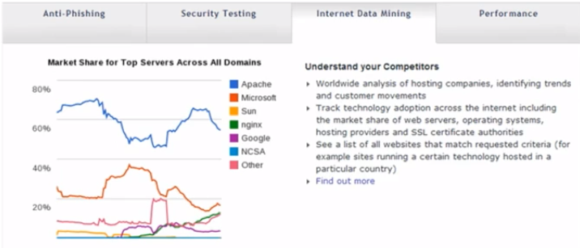

## 1.4 Linux应用领域

1、基于Linux的企业服务器

网址： www.netcraft.com 可以查看网站搭建，比如说输入qq.com就可以查看服务器

www.top500.org 

2、嵌入式应用

- 手机、平板电脑（安卓系统）

- 智能家电：机顶盒 游戏机 数码相机等

- 智能卡系统 航空系统 银行系统 卡拉OK点歌系统

  ...

3、Linux在电影娱乐业

这些影片都是在linux系统中处理的。

