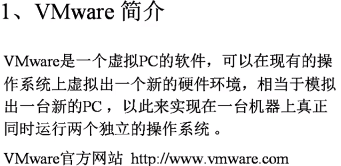
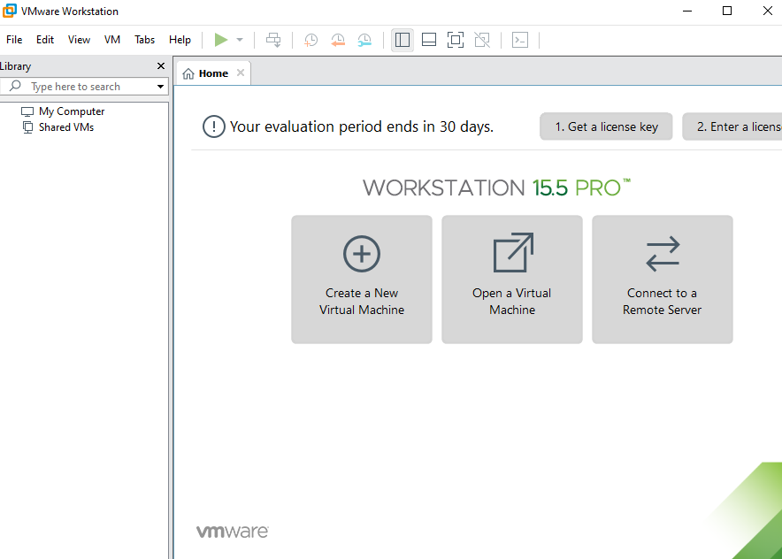
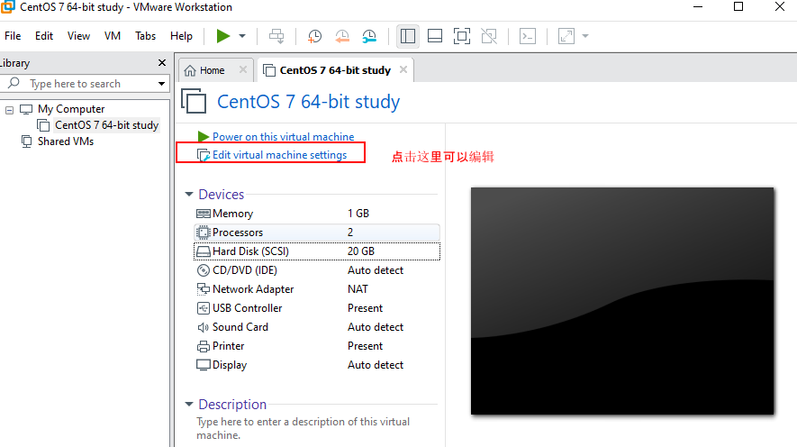

## VMware虚拟机的安装与使用

VMware主要特点：

- 不需要分区或重新开机就能在同一台pC上使用两种以上的操作系统
- 本机系统可与与虚拟机系统网络通信
- 可以设定并且随时修改虚拟机操作系统的硬件环境

2、建议的VMware配置

- CPU：建议主频为1GHz以上
- 内存：建议1GB以上
- 硬盘：建议分区空闲空间8GB以上

3、安装VMweare  建议以前的版本8.0.4

直接下一步安装。安装位置放在任何一个位置就可以，尽量不要安装在C盘

centos下载地址：http://isoredirect.centos.org/centos/7/isos/x86_64/ 选择华为的会快很多

