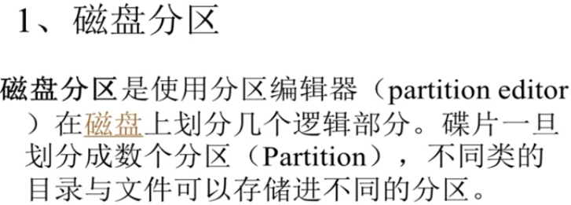
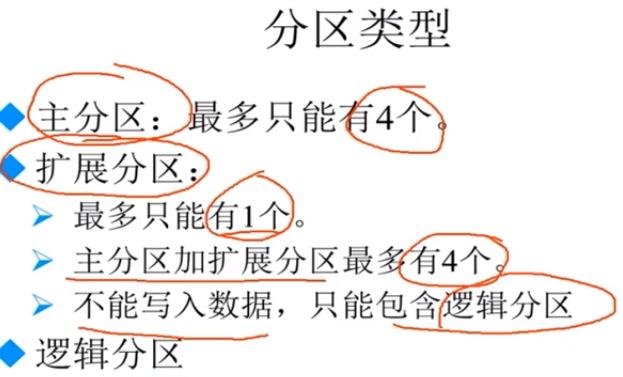
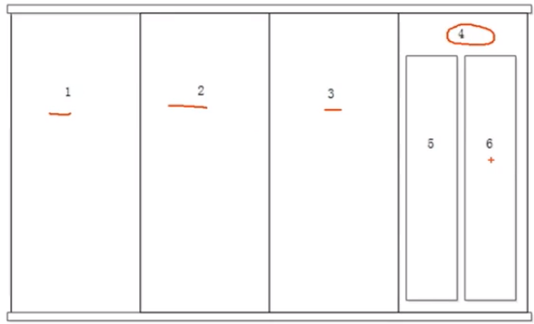
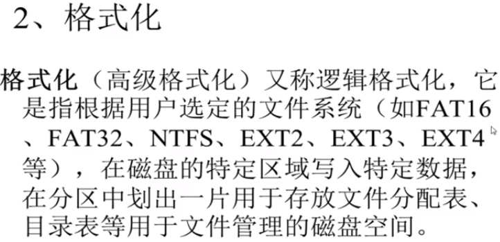
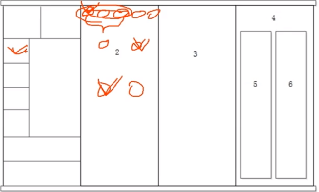
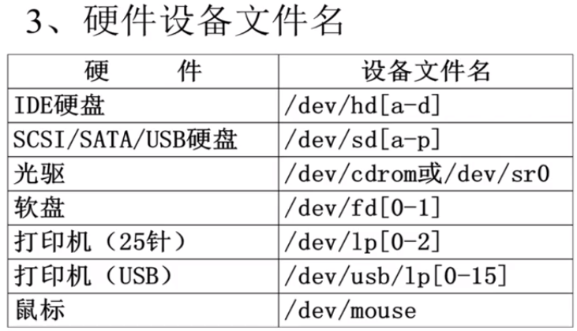
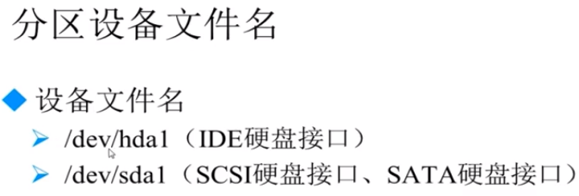
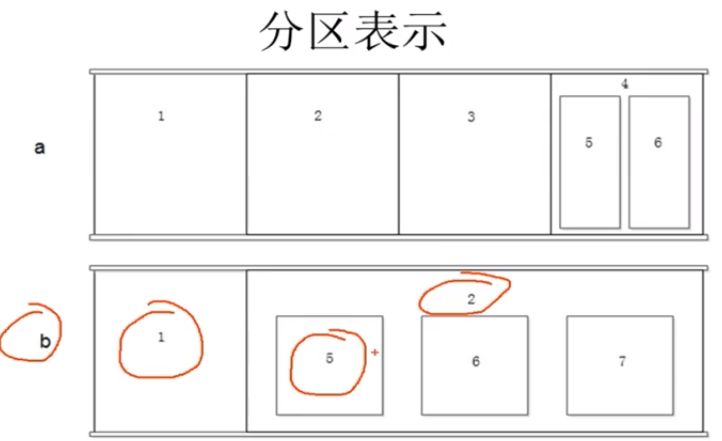
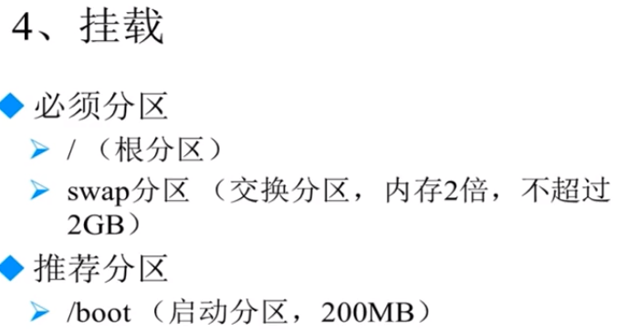
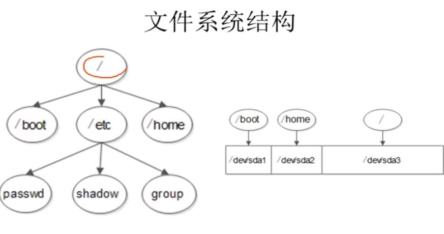

## 2.2 系统分区

block，每个block区可以是4K的大小。每个文件都应该有他的编号

我们要做的就是能能够看懂。

后边的数字是分区的名字。第二个分区就是sda2

1-4只能由主分区使用 5以上的数据都是逻辑分区

> 总结

- 分区：把大硬盘分为小的逻辑分区
- 格式化：写入文件系统
- 分区设备文件名，给每个分区定义设备文件名
- 挂载：给每个分区分配挂载点

