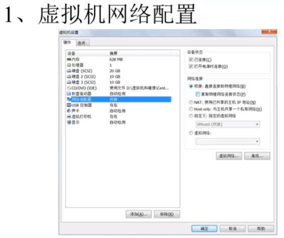
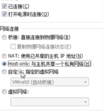
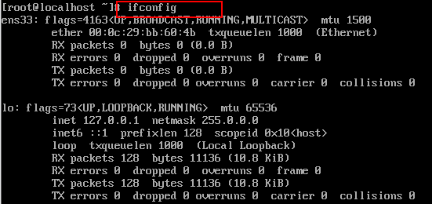
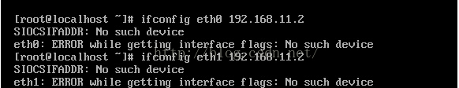
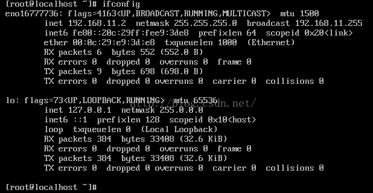
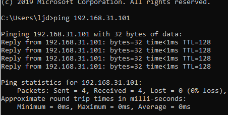

## 2.4远程登录工具

查询网卡的信息。

> 问题1：ifconfig配置网络时，出现“SIOCSIFADDR: No such device”和“eth0:ERROR while getting interface flags:No such dev”

答案：最近刚学习linux，参考教学视频，试着使用ifconfig命令来设置网卡参数，命令为“ifconfig eth0 192.168.11.2”。但结果显示“SIOCSIFADDR: No such device”“eth0:ERROR while getting interface flags:No such device”，截图如下。

在网上查找了很久，后来有人提示，也许你的网卡名字不是“eth0”，而是其他的名字。于是我单独输入一行代码“ifconfig -a”来检查所有的网卡参数，结果发现我的网卡名字没有“eth0”，而是叫“eno16777736”。所以要修改网卡参数的真正语句应该是“ifconfig eno16777736 192.168.11.2”。

之后我使用secureCRT远程登入管理工具，使用“192.168.11.2”，顺利远程登入了虚拟机！

更改IP地址，ifconfig这个只是临时的改变、需要改变里面的配置项才能永久生效。用命令的话只是临时的，只有更改配置。

`ifconfig eht0(自己的网卡名字) 192.168.31.101(自己填写的ip网段)`

